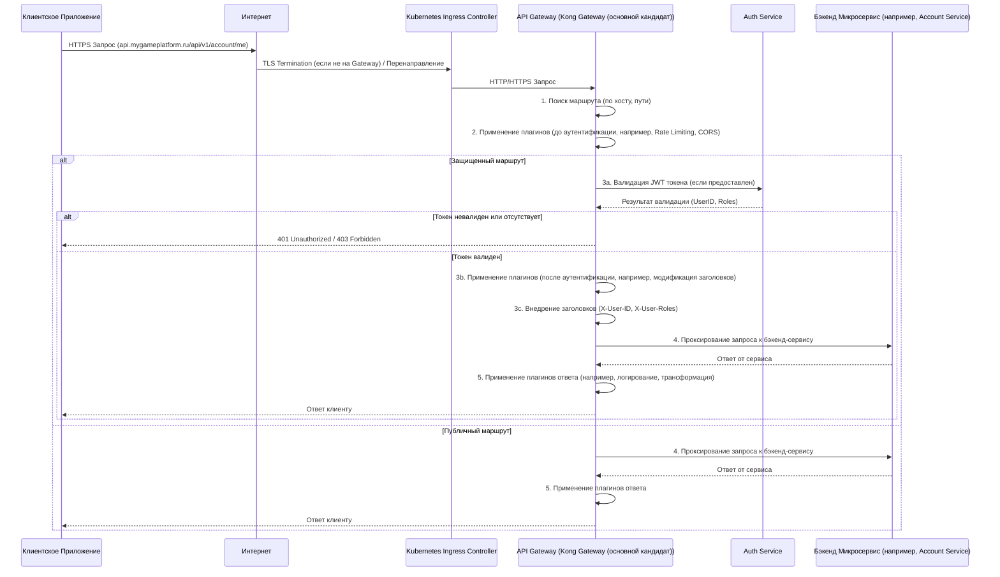

<!-- backend\api-gateway\docs\README.md -->
# Спецификация Микросервиса: API Gateway

**Версия:** 1.0
**Дата последнего обновления:** 2024-07-16

## 1. Обзор Сервиса (Overview)

### 1.1. Назначение и Роль
*   API Gateway является критически важным инфраструктурным компонентом, служащим единой точкой входа для всех внешних клиентских запросов к платформе "Российский Аналог Steam".
*   Его основная роль - предоставить унифицированный и безопасный фасад для различных бэкенд-микросервисов. Он обрабатывает общие сквозные задачи, такие как маршрутизация запросов, аутентификация и авторизация, ограничение скорости (rate limiting) и терминирование SSL/TLS.
*   Основные бизнес-задачи: Упрощение клиентской разработки, повышение безопасности и управляемости платформы, централизация управления доступом к API, снижение нагрузки на бэкенд-сервисы за счет обработки общих задач.
*   Разработка конфигурации и управление API Gateway должны вестись в соответствии с `../../../../CODING_STANDARDS.md` (в части управления конфигурационными файлами) и `../../../../project_deployment_standards.md` (GitOps принципы).

### 1.2. Ключевые Функциональности
*   **Маршрутизация запросов:** Динамическая маршрутизация входящих клиентских запросов (HTTP, HTTPS, WebSocket) к соответствующим бэкенд-микросервисам на основе пути, хоста, метода или заголовков. Поддержка перезаписи пути и балансировки нагрузки.
*   **Аутентификация и Авторизация:** Интеграция с Auth Service для валидации учетных данных клиентов (в основном JWT, также API ключи). Выполнение первичных проверок авторизации и внедрение контекста пользователя (ID, роли) в запросы, перенаправляемые внутренним сервисам.
*   **Ограничение скорости (Rate Limiting):** Защита бэкенд-сервисов от перегрузки путем применения лимитов на частоту запросов от отдельных клиентов, IP-адресов или на основе других критериев.
*   **Терминирование SSL/TLS:** Обработка HTTPS запросов, их расшифровка и перенаправление (обычно по HTTP или mTLS) внутренним сервисам. Управление сертификатами.
*   **Управление CORS (Cross-Origin Resource Sharing):** Централизованное применение политик CORS для всех или избранных маршрутов.
*   **Обеспечение безопасности:** Слой защиты от распространенных веб-атак (например, интеграция с Web Application Firewall - WAF), применение стандартных заголовков безопасности (HSTS, CSP, X-Frame-Options и т.д.).
*   **Трансформация запросов/ответов (опционально):** Модификация заголовков (добавление/удаление/изменение), и в редких случаях, тела запросов и ответов для адаптации к требованиям бэкенд-сервисов или клиентов.
*   **Обнаружение сервисов (Service Discovery):** Интеграция с Kubernetes для динамического обнаружения и маршрутизации к работоспособным экземплярам (подам) бэкенд-сервисов.
*   **Мониторинг, Логирование и Трассировка:** Сбор метрик, логов и участие в распределенной трассировке для всего входящего и исходящего трафика.
*   **Проксирование WebSocket:** Поддержка проксирования WebSocket соединений к соответствующим бэкенд-сервисам (например, Notification Service, Social Service).
*   **Кэширование ответов (опционально):** Возможность кэширования ответов от бэкенд-сервисов для снижения нагрузки и улучшения времени отклика.

### 1.3. Основные Технологии
*   **Gateway Software:** Kong Gateway (основной кандидат) (согласно `../../../../project_technology_stack.md`). Kong Gateway рассматривается как основной кандидат.
*   **Оркестрация и Управление Конфигурацией:**
    *   Kubernetes (версия 1.25+).
    *   Модель конфигурации: Kubernetes Gateway API CRDs (предпочтительно) или специфичные CRD для выбранного Gateway (например, KongIngress, TykAPIDefinition).
    *   Управление конфигурацией через GitOps (`../../../../project_deployment_standards.md`).
*   **Обнаружение сервисов:** Kubernetes Services DNS.
*   **Ingress Control:** Обычно API Gateway работает в связке с Ingress Controller (например, Nginx Ingress, Traefik Ingress), который управляет внешним трафиком на уровне L4/L7 и может направлять его на API Gateway.
*   **Мониторинг и Логирование:** Интеграция с Prometheus, Grafana, Loki/ELK, Jaeger/OpenTelemetry (согласно `../../../../project_observability_standards.md`).
*   Ссылки на: `../../../../project_technology_stack.md`, `../../../../project_deployment_standards.md`, `../../../../project_observability_standards.md`, `../../../../project_glossary.md`.

### 1.4. Термины и Определения (Glossary)
*   См. `../../../../project_glossary.md`.
*   **CRD (Custom Resource Definition):** Расширение API Kubernetes, позволяющее определять кастомные типы ресурсов.
*   **Ingress Controller:** Компонент Kubernetes, управляющий внешним доступом к сервисам в кластере, обычно работающий на уровне HTTP/HTTPS.
*   **Kubernetes Gateway API:** Новая спецификация Kubernetes для моделирования сетевых сервисов, предоставляющая более гибкие и мощные возможности по сравнению с Ingress API.
*   **GitOps:** Подход к управлению инфраструктурой и приложениями, при котором Git-репозиторий является единственным источником правды для декларативного описания желаемого состояния системы.

## 2. Внутренняя Архитектура (Internal Architecture)

### 2.1. Общее Описание
*   API Gateway функционирует как обратный прокси и центральный узел управления API. Его архитектура определяется выбранным программным обеспечением (например, Kong или Tyk) и его интеграцией с Kubernetes.
*   Основная логика работы Gateway заключается в применении набора правил и политик (маршруты, плагины/фильтры) к проходящему трафику. Эти правила и политики декларативно конфигурируются через Kubernetes CRDs и управляются с помощью GitOps.
*   Ниже представлены диаграммы, иллюстрирующие поток запросов и место API Gateway в общей архитектуре.

### 2.2. Диаграммы Архитектуры

#### 2.2.1. Поток Запроса через API Gateway


#### 2.2.2. API Gateway в Kubernetes Кластере
```mermaid
graph TD
    subgraph "Интернет"
        Users[Клиенты (Веб, Мобильные, Десктоп)]
    end

    subgraph "Kubernetes Кластер"
        direction LR
        LB[Load Balancer (Внешний)]
        LB --> Ingress[Ingress Controller (Nginx/Traefik)]

        subgraph "API Gateway Pods (namespace: gateway-infra)"
            direction TB
            APIGW_Pod1[API Gateway Pod 1 (Kong/Tyk)]
            APIGW_Pod2[API Gateway Pod 2 (...)]
            APIGW_PodN[API Gateway Pod N]
        end
        Ingress --> APIGW_Pod1
        Ingress --> APIGW_Pod2
        Ingress --> APIGW_PodN

        APIGW_Pod1 --> K8sServiceDiscovery[Kubernetes Service Discovery (CoreDNS)]
        K8sServiceDiscovery --> BackendServices[Бэкенд Сервисы (Pods & Services)]

        APIGW_Pod1 -- Reads CRDs --> K8sAPIServer[Kubernetes API Server]
        GitOpsController[GitOps Controller (ArgoCD/Flux)] -- Applies CRDs --> K8sAPIServer

        subgraph "Observability Stack"
            Prometheus[Prometheus]
            Grafana[Grafana]
            Loki[Loki]
            Jaeger[Jaeger]
        end
        APIGW_Pod1 -- Metrics --> Prometheus
        APIGW_Pod1 -- Logs --> Loki
        APIGW_Pod1 -- Traces --> Jaeger

        AuthService[Auth Service]
        APIGW_Pod1 -- Validate Tokens --> AuthService
    end

    Users --> LB
    GitRepo[Git Репозиторий (Конфигурация Gateway)] --> GitOpsController

    classDef internet fill:#f9f,stroke:#333,stroke-width:2px;
    classDef k8s fill:#ccf,stroke:#333,stroke-width:2px;
    classDef gateway fill:#cfc,stroke:#333,stroke-width:2px;
    classDef observability fill:#ffc,stroke:#333,stroke-width:2px;
    classDef gitops fill:#e2e2e2,stroke:#333,stroke-width:2px;

    class Users,Internet internet;
    class LB,Ingress,K8sServiceDiscovery,BackendServices,K8sAPIServer,AuthService k8s;
    class APIGW_Pod1,APIGW_Pod2,APIGW_PodN gateway;
    class Prometheus,Grafana,Loki,Jaeger observability;
    class GitRepo,GitOpsController gitops;
```

### 2.3. "Слои" API Gateway (применительно к его функционированию и конфигурации)

#### 2.3.1. Слой Конфигурации (Configuration Plane / Presentation Layer для конфигурации)
*   Ответственность: Определяет, как администраторы платформы или автоматизированные системы (CI/CD, GitOps-контроллеры) конфигурируют поведение Gateway.
*   Ключевые компоненты:
    *   Kubernetes API Server (для CRDs).
    *   CRDs: `GatewayClass`, `Gateway`, `HTTPRoute`, `TCPRoute`, `UDPRoute`, `TLSRoute` (стандарт Kubernetes Gateway API) или специфичные CRD выбранного вендора (например, `KongIngress`, `KongPlugin` для Kong; `APIDefinition` для Tyk).
    *   GitOps контроллер (например, ArgoCD, Flux), который синхронизирует состояние из Git-репозитория с кластером.

#### 2.3.2. Слой Управления (Control Plane - ядро Gateway)
*   Ответственность: Трансляция декларативной конфигурации (из CRD) во внутренние правила и настройки проксирующего движка. Динамическое обновление конфигурации без прерывания трафика. Обнаружение сервисов.
*   Ключевые компоненты: Внутренние компоненты выбранного ПО API Gateway, отвечающие за чтение конфигурации, взаимодействие с Kubernetes API, управление жизненным циклом плагинов.

#### 2.3.3. Слой Данных (Data Plane - проксирующий движок Gateway)
*   Ответственность: Непосредственная обработка и проксирование клиентских запросов согласно сконфигурированным правилам. Применение плагинов/фильтров (аутентификация, rate limiting, трансформация заголовков и т.д.).
*   Ключевые компоненты: Высокопроизводительный прокси-сервер (например, Nginx в Kong, собственный движок в Tyk).

#### 2.3.4. Слой Интеграций (Infrastructure Layer для Gateway)
*   Ответственность: Взаимодействие с внешними по отношению к Gateway системами.
*   Ключевые компоненты:
    *   Клиенты Kubernetes API (для service discovery, чтения CRD).
    *   HTTP/gRPC клиенты для взаимодействия с Auth Service (валидация токенов).
    *   Экспортеры метрик в Prometheus.
    *   Агенты для отправки логов в Loki/ELK.
    *   Агенты для отправки трейсов в Jaeger/OpenTelemetry Collector.

## 3. API Endpoints (Конфигурируемые маршруты)
API Gateway сам по себе не определяет бизнес-эндпоинты, а **маршрутизирует** запросы к эндпоинтам, определенным в бэкенд-микросервисах.
*   См. документацию каждого микросервиса для деталей их API.
*   См. `../../../../project_api_standards.md` для общих стандартов API, которые API Gateway помогает обеспечивать.
*   Конфигурация маршрутов, сервисов и политик осуществляется декларативно с использованием CRD Kubernetes (например, Gateway API `HTTPRoute`).

**Пример конфигурации маршрута (иллюстративный, на основе Kubernetes Gateway API `HTTPRoute`):**
```yaml
apiVersion: gateway.networking.k8s.io/v1beta1
kind: HTTPRoute
metadata:
  name: account-service-api-v1-route
  namespace: services # Пространство имен, где развернуты целевые сервисы
spec:
  parentRefs:
  - name: main-platform-gateway # Имя ресурса Gateway
    namespace: gateway-infra    # Пространство имен, где развернут Gateway
  hostnames:
  - "api.mygameplatform.ru" # Хостнейм, для которого действует этот маршрут
  rules:
  - matches:
    - path:
        type: PathPrefix # Тип совпадения пути
        value: /api/v1/account # Путь, который будет матчиться
    filters:
    # Пример фильтра для JWT аутентификации (зависит от реализации Gateway)
    # - type: RequestHeaderModifier # (Это не JWT, а пример модификации)
    #   requestHeaderModifier:
    #     add:
    #     - name: X-Authenticated-By
    #       value: "jwt-plugin"
    - type: ExtensionRef # Для плагинов, специфичных для реализации Gateway
      extensionRef:
        group: gateway.konghq.com # Пример для Kong
        kind: KongPlugin
        name: jwt-auth-plugin-for-platform-users
    backendRefs:
    - name: account-service # Имя Kubernetes Service для Account Service
      port: 80 # Порт этого Service
      weight: 1
```
**Примечание:** Приведенный выше YAML является упрощенным и иллюстративным. Полная, операционная конфигурация API Gateway, включая все маршруты, политики безопасности, плагины и их параметры, находится в специализированном GitOps репозитории проекта (например, `deploy/platform-gitops/gateway-config/`) и управляется через CI/CD пайплайны. См. `../../../../project_deployment_standards.md`.

## 4. Модели Данных (Конфигурационные)
API Gateway не хранит бизнес-данные. Его "модели данных" - это структуры его конфигурации, определяемые CRD (например, `Gateway`, `HTTPRoute`, `KongPlugin`, `TykAPIDefinition`).

## 5. Потоковая Обработка Событий (Event Streaming)
API Gateway напрямую не участвует в потоковой обработке бизнес-событий Kafka, но:
*   Генерирует операционные события/логи (доступ, ошибки), которые экспортируются в системы логирования/мониторинга и могут далее анализироваться.
*   Проксирует WebSocket соединения для сервисов, использующих real-time коммуникации.

## 6. Интеграции (Integrations)
См. `../../../../project_integrations.md` для общей карты и деталей.

### 6.1. Внутренние Микросервисы
*   **Auth Service:** HTTP/gRPC вызовы для валидации JWT токенов / API ключей.
*   **Все бэкенд-микросервисы:** Проксирование клиентских запросов к ним. API Gateway добавляет заголовки (`X-User-ID`, `X-User-Roles`, `X-Request-ID`) после аутентификации.
*   **Kubernetes API:** Для Service Discovery и чтения конфигурации CRD.

### 6.2. Внешние Системы
*   **Клиентские приложения:** Основные потребители API через Gateway.
*   **Системы Мониторинга/Логирования/Трассировки:** Экспорт данных (Prometheus, Loki, Jaeger).
*   **WAF (Web Application Firewall):** Может быть интегрирован перед API Gateway.

## 7. Конфигурация (Configuration)
Общие стандарты конфигурации см. в `../../../../project_api_standards.md` и `../../../../DOCUMENTATION_GUIDELINES.md`.

### 7.1. Конфигурация API Gateway (Declarative - GitOps)
*   Основная конфигурация API Gateway (маршруты, сервисы, плагины для аутентификации, авторизации, rate limiting, CORS, трансформации и т.д.) управляется декларативно с использованием Kubernetes Custom Resource Definitions (CRDs).
*   Эти CRD (например, `HTTPRoute`, `TCPRoute`, `KongIngress`, `KongPlugin`, `TykAPIDefinition`) хранятся в выделенном Git-репозитории (GitOps-репозиторий, например, `deploy/gitops/api-gateway-config/`) и автоматически синхронизируются с Kubernetes кластером с помощью инструментов GitOps (ArgoCD, Flux).
*   Такой подход обеспечивает версионирование конфигурации, возможность аудита изменений, упрощает откат к предыдущим версиям и повышает надежность управления конфигурацией.

### 7.2. Переменные Окружения (для самого ПО Gateway)
*   Непосредственно для программного обеспечения API Gateway (например, для подов Kong или Tyk) могут использоваться переменные окружения для настройки базовых параметров его работы, таких как:
    *   Уровни логирования самого Gateway.
    *   Адреса и порты для административных API Gateway (если есть).
    *   Параметры подключения к базе данных конфигурации Gateway (если используется, например, PostgreSQL для Kong).
    *   Настройки интеграции с системами мониторинга и трассировки.
    *   Идентификаторы кластера или окружения.
*   Примеры:
    *   `KONG_LOG_LEVEL=info`
    *   `KONG_DATABASE=postgres`
    *   `KONG_PG_HOST=kong-db.internal`
    *   `KONG_PROXY_LISTEN=0.0.0.0:8000, 0.0.0.0:8443 ssl`
    *   `TYK_LOGLEVEL=info`
    *   `TYK_GATEWAY_CONF_KV_HOST=redis.internal`
*   Эти переменные обычно устанавливаются через Kubernetes Deployments/StatefulSets для подов API Gateway и управляются через Helm-чарты или аналогичные инструменты. Секреты (пароли к БД) должны управляться через Kubernetes Secrets.

## 8. Обработка Ошибок (Error Handling)
См. `../../../../project_api_standards.md` для общих принципов формата ошибок.

### 8.1. Ошибки, генерируемые API Gateway
API Gateway может генерировать собственные ошибки в случаях, когда запрос не может быть обработан или перенаправлен бэкенд-сервису.
*   **Примеры кодов ошибок и их ответов (согласно `../../../../project_api_standards.md`):**
    *   **`400 Bad Request`** (Некорректный синтаксис запроса к Gateway):
        ```json
        {
          "errors": [
            {
              "code": "INVALID_REQUEST_SYNTAX",
              "title": "Некорректный синтаксис запроса",
              "detail": "Запрос не может быть обработан из-за синтаксической ошибки на стороне клиента."
            }
          ]
        }
        ```
    *   **`401 Unauthorized`** (Ошибка аутентификации на уровне Gateway):
        ```json
        {
          "errors": [
            {
              "code": "AUTHENTICATION_FAILED",
              "title": "Ошибка аутентификации",
              "detail": "Учетные данные для аутентификации не были предоставлены или недействительны."
            }
          ]
        }
        ```
    *   **`403 Forbidden`** (Доступ запрещен политикой Gateway):
        ```json
        {
          "errors": [
            {
              "code": "FORBIDDEN_BY_GATEWAY_POLICY",
              "title": "Доступ запрещен политикой шлюза",
              "detail": "У вас нет разрешения на доступ к этому ресурсу через данный шлюз, или ваш IP-адрес заблокирован."
            }
          ]
        }
        ```
    *   **`404 Not Found`** (Маршрут не найден):
        ```json
        {
          "errors": [
            {
              "code": "ROUTE_NOT_FOUND",
              "title": "Маршрут не найден",
              "detail": "Запрашиваемый URL не соответствует ни одному настроенному маршруту на API Gateway."
            }
          ]
        }
        ```
    *   **`429 Too Many Requests`** (Превышен лимит запросов):
        ```json
        {
          "errors": [
            {
              "code": "RATE_LIMIT_EXCEEDED",
              "title": "Превышен лимит запросов",
              "detail": "Вы отправили слишком много запросов за короткий промежуток времени. Пожалуйста, повторите попытку позже.",
              "meta": { "retry_after_seconds": 60 } // Опционально
            }
          ]
        }
        ```
    *   **`502 Bad Gateway`** (Ошибка связи с бэкенд-сервисом или некорректный ответ от него):
        ```json
        {
          "errors": [
            {
              "code": "UPSTREAM_SERVICE_ERROR",
              "title": "Ошибка вышестоящего сервиса",
              "detail": "Сервер, выступая в роли шлюза, получил недействительный ответ от вышестоящего сервера или не смог установить с ним соединение."
            }
          ]
        }
        ```
    *   **`503 Service Unavailable`** (Бэкенд-сервис недоступен или сам Gateway перегружен):
        ```json
        {
          "errors": [
            {
              "code": "SERVICE_UNAVAILABLE",
              "title": "Сервис временно недоступен",
              "detail": "Сервер в данный момент не может обработать запрос из-за временной перегрузки или технического обслуживания. Пожалуйста, повторите попытку позже."
            }
          ]
        }
        ```
    *   **`504 Gateway Timeout`** (Бэкенд-сервис не ответил в установленный таймаут):
        ```json
        {
          "errors": [
            {
              "code": "UPSTREAM_TIMEOUT",
              "title": "Таймаут ответа вышестоящего сервиса",
              "detail": "Сервер, выступая в роли шлюза, не дождался ответа от вышестоящего сервера в течение установленного времени."
            }
          ]
        }
        ```
*   Ошибки от бэкенд-сервисов, как правило, проксируются клиенту "как есть", если их формат соответствует `project_api_standards.md`. Если формат не соответствует, Gateway может попытаться обернуть их в стандартный формат или вернуть общую ошибку 502/503.

## 9. Безопасность (Security)
См. `../../../../project_security_standards.md` для общих стандартов. API Gateway играет ключевую роль в обеспечении безопасности платформы:
*   **Терминирование SSL/TLS:** Централизованное управление сертификатами и шифрованием внешнего трафика.
*   **Аутентификация:** Валидация JWT токенов или API ключей (через интеграцию с Auth Service). Отклонение неаутентифицированных запросов.
*   **Авторизация (базовая):** Может выполнять проверку наличия определенных ролей или разрешений, необходимых для доступа к группам маршрутов.
*   **Ограничение скорости (Rate Limiting):** Защита от DoS/DDoS атак и злоупотреблений API.
*   **Защита от веб-уязвимостей:** Применение политик WAF (если интегрирован), валидация запросов (базовая), применение заголовков безопасности (HSTS, CSP, X-Content-Type-Options, X-XSS-Protection, X-Frame-Options).
*   **Сокрытие внутренней архитектуры:** Клиенты взаимодействуют только с Gateway, не зная о внутренней структуре микросервисов.
*   **Логирование доступа и аудит безопасности:** Все запросы и ответы, проходящие через Gateway, могут логироваться для последующего анализа безопасности.

## 10. Развертывание (Deployment)
См. `../../../../project_deployment_standards.md` для общих стандартов.
*   API Gateway развертывается как набор подов в Kubernetes, обычно в выделенном пространстве имен (например, `gateway-infra`).
*   Конфигурация (маршруты, плагины) управляется декларативно через CRD и GitOps.
*   Обновления ПО Gateway и его конфигурации должны проходить через стандартные процессы CI/CD с тестированием.

## 11. Мониторинг и Логирование (Logging and Monitoring)
См. `../../../../project_observability_standards.md` для общих стандартов.
*   API Gateway является важным источником метрик, логов и трейсов для всей платформы.
*   Ключевые метрики: количество запросов (общее, по маршрутам, по кодам ответа), задержка (общая, задержка бэкендов, задержка самого Gateway), количество активных соединений, состояние upstream-сервисов.
*   Логи доступа должны содержать `trace_id` для корреляции с трейсами в Jaeger и логами бэкенд-сервисов.

## 12. Нефункциональные Требования (NFRs)
*   **Производительность**:
    *   Дополнительная задержка (P99), вносимая Gateway (без учета времени на внешние вызовы типа Auth Service): < 5-10 мс.
    *   Дополнительная задержка на плагин аутентификации JWT (локальная валидация): P99 < 2 мс.
    *   Пропускная способность: должна быть способна обрабатывать пиковую нагрузку всех публичных API платформы (цель: >10,000-20,000 запросов/сек на стандартной конфигурации кластера Gateway).
*   **Масштабируемость**:
    *   Горизонтальное масштабирование: Поддержка автоматического масштабирования количества подов Gateway (HPA) на основе загрузки CPU/памяти.
    *   Способность обрабатывать до 5000 сконфигурированных маршрутов без существенной деградации производительности.
*   **Надежность**:
    *   Высокая доступность (High Availability): > 99.99% для плоскости данных (data plane).
    *   Отказоустойчивость: Сбой одного экземпляра Gateway не должен приводить к потере доступности API.
    *   Время перезагрузки конфигурации (например, после обновления CRD через GitOps): P95 < 30 секунд без потери трафика.
*   **Безопасность**:
    *   Надежная защита от распространенных атак уровня L7 (см. OWASP Top 10).
    *   Безопасная обработка и хранение (если необходимо кратковременно) учетных данных и токенов.
    *   Своевременное применение обновлений безопасности для используемого ПО Gateway.
*   **Сопровождаемость**:
    *   Конфигурация полностью управляется через GitOps.
    *   Простота добавления новых маршрутов и политик стандартными средствами Kubernetes.
    *   Исчерпывающие метрики и логи для диагностики проблем.

## 13. Резервное Копирование и Восстановление (Backup and Recovery)

### 13.1. Конфигурация API Gateway (CRDs)
*   **Процедура резервного копирования:**
    *   Основным источником правды для конфигурации API Gateway (маршруты, плагины, политики, определенные через CRD) является Git-репозиторий, используемый в рамках подхода GitOps.
    *   Регулярное резервное копирование самого Git-репозитория (стандартные процедуры бэкапа для Git-сервера, например, GitLab/GitHub Enterprise).
    *   Дополнительно, состояние ресурсов Kubernetes (включая CRD Gateway) в кластере может периодически бэкапироваться с использованием инструментов типа Velero.
*   **Процедура восстановления:**
    *   Восстановление конфигурации осуществляется путем применения манифестов из Git-репозитория (через GitOps-контроллер) к новому или восстановленному кластеру Kubernetes.
    *   Если использовался Velero, возможно восстановление состояния CRD из бэкапа кластера.
*   **RTO (Recovery Time Objective):** < 1 часа (в основном зависит от времени развертывания Gateway и применения конфигурации из Git).
*   **RPO (Recovery Point Objective):** Близко к нулю (потери ограничиваются последними изменениями в Git, еще не примененными GitOps-контроллером).

### 13.2. Собственная База Данных API Gateway (если используется)
*   Некоторые решения API Gateway (например, Kong Gateway в традиционном режиме, не DB-less) могут использовать внешнюю базу данных (например, PostgreSQL) для хранения своей конфигурации, состояния плагинов, потребителей и т.д.
*   **Процедура резервного копирования:**
    *   Если используется PostgreSQL, применяются стандартные процедуры резервного копирования PostgreSQL, описанные в `../../../../project_database_structure.md` (ежедневные `pg_dump`, непрерывная архивация WAL).
    *   **Хранение:** Бэкапы хранятся в S3-совместимом хранилище с шифрованием и версионированием.
*   **Процедура восстановления:** Стандартное восстановление PostgreSQL.
*   **RTO:** < 2-4 часов (в зависимости от размера БД).
*   **RPO:** < 5-15 минут.
*   **Примечание:** Предпочтительным является использование API Gateway в режиме DB-less (например, Kong в режиме DB-less с конфигурацией через CRD), где вся конфигурация хранится декларативно в CRD Kubernetes. Это упрощает резервное копирование и восстановление, сводя его к управлению конфигурацией в Git.

### 13.3. Общая стратегия
*   Основной упор на GitOps для конфигурации Gateway, что обеспечивает версионируемость и простоту восстановления.
*   Если Gateway использует собственную БД (что не является предпочтительным вариантом), применяются стандартные практики ее резервного копирования.
*   Мониторинг работоспособности Gateway и процессов применения конфигурации.

## 14. Пользовательские Сценарии (User Flows)

В этом разделе описаны ключевые сценарии взаимодействия с API Gateway, демонстрирующие его роль как единой точки входа и компонента управления API.

### 14.1. Запрос Клиента к Публичному Эндпоинту

*   **Описание:** Внешний клиент (например, веб-приложение) делает запрос к публично доступному эндпоинту (например, получение списка новостей), который не требует аутентификации.
*   **Диаграмма:**
    ```mermaid
    sequenceDiagram
        actor Client as Клиент
        participant APIGW as API Gateway
        participant NewsSvc as News Service (Бэкенд)

        Client->>APIGW: GET /api/v1/news
        APIGW->>APIGW: Поиск маршрута для /api/v1/news
        APIGW->>APIGW: Применение CORS-политик (если междоменный запрос)
        APIGW->>APIGW: Применение плагинов для публичных маршрутов (например, rate limiting по IP)
        APIGW->>NewsSvc: Проксирование запроса GET /api/v1/news
        NewsSvc-->>APIGW: HTTP 200 OK (список новостей)
        APIGW->>APIGW: Применение плагинов ответа (например, логирование, модификация заголовков)
        APIGW-->>Client: HTTP 200 OK (список новостей)
    ```

### 14.2. Запрос Клиента к Защищенному Эндпоинту с Аутентификацией

*   **Описание:** Внешний клиент, предварительно получивший JWT от Auth Service, делает запрос к защищенному эндпоинту (например, получение данных профиля пользователя). API Gateway валидирует JWT и проксирует запрос.
*   **Диаграмма:**
    ```mermaid
    sequenceDiagram
        actor Client as Клиент
        participant AuthSvcExt as Auth Service (Внешний вызов)
        participant APIGW as API Gateway
        participant AccountSvc as Account Service (Бэкенд)

        Client->>AuthSvcExt: Запрос на аутентификацию (логин/пароль)
        AuthSvcExt-->>Client: JWT (Access Token)

        Client->>APIGW: GET /api/v1/account/me (Authorization: Bearer <JWT>)
        APIGW->>APIGW: Поиск маршрута для /api/v1/account/me
        APIGW->>APIGW: Обнаружение требования аутентификации (через конфигурацию плагина JWT)
        APIGW->>AuthSvcExt: (Опционально, если требуется интроспекция) Валидация JWT / Получение доп. информации
        AuthSvcExt-->>APIGW: (Опционально) Результат валидации / Информация о пользователе
        alt JWT валиден
            APIGW->>APIGW: Извлечение UserID, Roles из JWT
            APIGW->>APIGW: Внедрение заголовков (X-User-ID, X-User-Roles) в запрос к AccountSvc
            APIGW->>AccountSvc: Проксирование GET /me (с новыми заголовками)
            AccountSvc-->>APIGW: HTTP 200 OK (данные профиля)
            APIGW-->>Client: HTTP 200 OK (данные профиля)
        else JWT невалиден
            APIGW-->>Client: HTTP 401 Unauthorized (Ошибка валидации JWT)
        end
    ```

### 14.3. Обработка Запроса, Превышающего Лимиты (Rate Limiting)

*   **Описание:** Клиент отправляет слишком много запросов за короткий промежуток времени, превышая настроенные лимиты. API Gateway блокирует запрос.
*   **Диаграмма:**
    ```mermaid
    sequenceDiagram
        actor Client as Клиент
        participant APIGW as API Gateway
        participant BackendSvc as Бэкенд Сервис

        loop Множество запросов
            Client->>APIGW: GET /api/v1/some-resource
            APIGW->>APIGW: Проверка Rate Limit (например, по IP или UserID)
            alt Лимит не превышен
                APIGW->>BackendSvc: Проксирование запроса
                BackendSvc-->>APIGW: Ответ
                APIGW-->>Client: Ответ
            else Лимит превышен
                APIGW-->>Client: HTTP 429 Too Many Requests (Retry-After заголовок)
                Note right of APIGW: Запрос не доходит до BackendSvc
                break
            end
        end
    ```

### 14.4. Маршрутизация Запроса к Определенной Версии Микросервиса (Canary/Blue-Green)

*   **Описание:** API Gateway настроен для направления части трафика (например, на основе заголовка, cookie или веса) к новой "canary" версии микросервиса, в то время как основной трафик идет к стабильной версии.
*   **Диаграмма:**
    ```mermaid
    sequenceDiagram
        actor Client as Клиент
        participant APIGW as API Gateway
        participant ProductSvcV1 as Product Service v1 (Stable)
        participant ProductSvcV2Canary as Product Service v2 (Canary)

        Client->>APIGW: GET /api/v1/products/123
        APIGW->>APIGW: Поиск маршрута для /api/v1/products/123
        APIGW->>APIGW: Анализ правил маршрутизации (например, заголовок `X-Canary: true` или случайное взвешивание)
        alt Маршрут к Canary
            APIGW->>ProductSvcV2Canary: Проксирование запроса
            ProductSvcV2Canary-->>APIGW: Ответ от v2
        else Маршрут к Stable
            APIGW->>ProductSvcV1: Проксирование запроса
            ProductSvcV1-->>APIGW: Ответ от v1
        end
        APIGW-->>Client: Ответ от соответствующей версии
    ```

### 14.5. Обновление Маршрутного Правила Администратором через GitOps

*   **Описание:** Администратор изменяет конфигурацию маршрута (например, добавляет новый путь или изменяет целевой сервис) в Git-репозитории. GitOps-контроллер обнаруживает изменения и применяет их к API Gateway.
*   **Диаграмма:**
    ```mermaid
    sequenceDiagram
        actor Admin as Администратор
        participant GitRepo as Git Репозиторий (Конфигурация Gateway)
        participant GitOpsController as GitOps Controller (ArgoCD/Flux)
        participant K8sAPIServer as Kubernetes API Server
        participant APIGWControlPlane as API Gateway Control Plane

        Admin->>GitRepo: Commit & Push (изменение CRD HTTPRoute)
        GitOpsController->>GitRepo: Обнаружение изменений (pull/webhook)
        GitOpsController->>K8sAPIServer: Apply CRD (обновленный HTTPRoute)
        K8sAPIServer->>APIGWControlPlane: Уведомление об изменении ресурса HTTPRoute
        APIGWControlPlane->>APIGWControlPlane: Обновление внутренней конфигурации маршрутизации

        Note over APIGWControlPlane: Новый маршрут активен без перезапуска Data Plane.
    ```

## 15. Приложения (Appendices)
*   Детальные примеры полной конфигурации маршрутов, плагинов и других аспектов API Gateway (включая специфичные для выбранного вендора CRD) доступны в специализированном GitOps репозитории проекта (например, `deploy/platform-gitops/gateway-config/` или аналогичном). Актуальные ссылки и структура этого репозитория должны поддерживаться во внутренней документации команды разработки DevOps/Platform Engineering.

---
*Этот документ является отправной точкой и должен регулярно обновляться по мере развития конфигурации API Gateway.*
