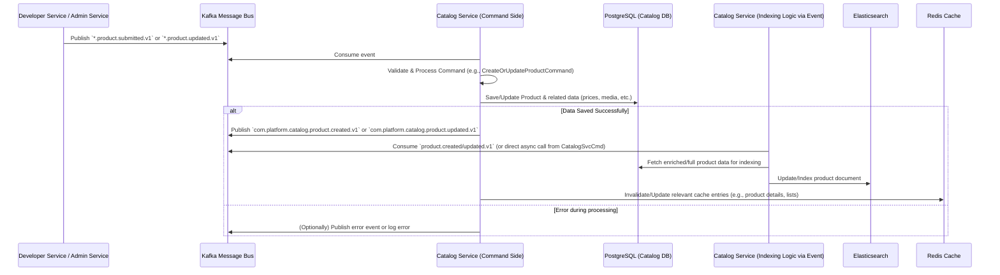
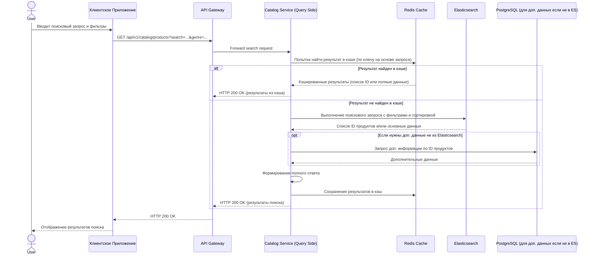

# Спецификация Микросервиса: Catalog Service

**Версия:** 1.0
**Дата последнего обновления:** 2024-07-11

## 1. Обзор Сервиса (Overview)

### 1.1. Назначение и Роль
*   **Назначение:** Catalog Service является ядром платформы "Российский Аналог Steam", отвечающим за управление всей информацией о цифровых продуктах (игры, DLC, программное обеспечение, комплекты), включая их метаданные, цены, таксономию и медиа-контент.
*   **Роль в общей архитектуре платформы:** Централизованное управление каталогом продуктов (игры, DLC, программное обеспечение, комплекты), ценообразованием, акциями, таксономией (жанры, теги, категории), медиа-контентом и метаданными достижений. Предоставляет данные другим микросервисам (например, Payment Service, Library Service, Analytics Service) и обеспечивает поиск и обнаружение продуктов пользователями через клиентские приложения.
*   **Основные бизнес-задачи:**
    *   Управление жизненным циклом продуктов (игры, DLC, бандлы, ПО).
    *   Управление метаданными продуктов: локализованные названия, описания, системные требования, информация о разработчиках/издателях, даты выпуска и т.д.
    *   Управление ценообразованием: базовые цены, региональные цены, управление скидками, промо-акциями и специальными предложениями.
    *   Управление таксономией: жанры, теги, категории, коллекции, франшизы.
    *   Обеспечение эффективного поиска, фильтрации и навигации по каталогу для пользователей и других сервисов.
    *   Управление медиа-контентом: скриншоты, трейлеры, обложки, арты (хранение ссылок и метаданных).
    *   Управление метаданными достижений (названия, описания, иконки, условия разблокировки).
    *   Интеграция с процессами модерации контента продуктов.
*   Разработка сервиса должна вестись в соответствии с `../../../../CODING_STANDARDS.md`.

### 1.2. Ключевые Функциональности
*   **Управление Продуктами:** CRUD операции для всех типов продуктов (игры, DLC, бандлы, ПО). Управление статусами продуктов (например, `draft`, `in_review`, `published`, `unpublished`, `archived`).
*   **Управление Метаданными:** Поддержка версионирования метаданных. Хранение и предоставление локализованных атрибутов (названия, описания, системные требования) на поддерживаемых языках. Управление информацией о разработчиках и издателях.
*   **Управление Ценами:** Установка и обновление базовых цен. Управление региональными ценами в различных валютах. Создание и управление скидками (процентные, фиксированные), промо-акциями (временные распродажи, специальные предложения на комплекты).
*   **Управление Таксономией:** CRUD операции для жанров, тегов, категорий. Присвоение продуктам элементов таксономии. Управление коллекциями (например, "Игры от издателя X", "Лучшие инди-игры 2024") и франшизами.
*   **Поиск и Фильтрация:** Предоставление API для полнотекстового поиска продуктов с учетом релевантности и морфологии языка. Расширенная фильтрация по множеству критериев (жанры, теги, цены, платформы, языки, наличие скидок, рейтинг и т.д.) и сортировка результатов.
*   **Управление Медиа:** Загрузка (через Developer/Admin Service), хранение ссылок и метаданных для изображений (скриншоты, обложки, арты) и видео (трейлеры, геймплейные ролики). Определение типов медиа и их порядка отображения.
*   **Управление Достижениями:** CRUD операции для метаданных достижений (название, описание, иконка, условия разблокировки, очки опыта и т.д.), связанных с конкретным продуктом.
*   **Интеграция с Модерацией:** Отслеживание и предоставление статуса модерации для продуктов и их контента. Взаимодействие с Admin Service.
*   **API для Рекомендаций:** Предоставление данных для систем рекомендаций (например, информация о популярных продуктах, новых релизах, продуктах с высоким рейтингом, похожих товарах).
*   **Публикация Событий:** Генерация и отправка событий в Kafka при создании, обновлении, удалении продуктов, изменении цен, публикации и других значимых изменениях в каталоге.

### 1.3. Основные Технологии
*   **Язык программирования:** Go (версия 1.21+, согласно `../../../../project_technology_stack.md`).
*   **Веб-фреймворк (REST):** Echo (`github.com/labstack/echo/v4`) (согласно `../../../../PACKAGE_STANDARDIZATION.md`).
*   **RPC фреймворк (gRPC):** `google.golang.org/grpc` (согласно `../../../../PACKAGE_STANDARDIZATION.md`).
*   **База данных (основная):** PostgreSQL (версия 15+) для хранения структурированных данных каталога. Драйвер: GORM (`gorm.io/gorm`) с `gorm.io/driver/postgres` или `pgx` (`github.com/jackc/pgx/v5`) (согласно `../../../../PACKAGE_STANDARDIZATION.md`).
*   **Поисковый движок:** Elasticsearch (версия 8.x+) для полнотекстового поиска и сложной фильтрации. Клиент: официальный Go клиент для Elasticsearch. (согласно `../../../../project_technology_stack.md`).
*   **Кэширование:** Redis (версия 7.0+) для кэширования часто запрашиваемых данных. Клиент: `go-redis/redis` (согласно `../../../../PACKAGE_STANDARDIZATION.md`).
*   **Брокер сообщений:** Apache Kafka (версия 3.x+). Клиент: `github.com/confluentinc/confluent-kafka-go` или `github.com/segmentio/kafka-go` (согласно `../../../../PACKAGE_STANDARDIZATION.md`).
*   **Управление конфигурацией:** Viper (`github.com/spf13/viper`) (согласно `../../../../PACKAGE_STANDARDIZATION.md`).
*   **Логирование:** Zap (`go.uber.org/zap`) (согласно `../../../../PACKAGE_STANDARDIZATION.md`).
*   **Мониторинг/Трассировка:** OpenTelemetry SDK, Prometheus client (`github.com/prometheus/client_golang`). (согласно `../../../../project_observability_standards.md`).
*   **Инфраструктура:** Docker, Kubernetes.
*   Ссылки на: `../../../../project_technology_stack.md`, `../../../../PACKAGE_STANDARDIZATION.md`, `../../../../project_glossary.md`.

### 1.4. Термины и Определения (Glossary)
*   **Продукт (Product):** Любой цифровой товар, доступный на платформе (например, Игра, Дополнение (DLC), Программное обеспечение, Комплект продуктов).
*   **Метаданные (Metadata):** Описательная информация о Продукте, такая как название, описание, разработчик, издатель, системные требования, дата выпуска и т.д.
*   **Таксономия (Taxonomy):** Система классификации Продуктов, включающая Жанры, Теги, Категории.
*   **Цена (Price):** Стоимость Продукта. Может включать базовую цену, региональные цены и временные скидки.
*   **Медиа-контент (Media Content):** Графические и видео материалы, связанные с продуктом (скриншоты, трейлеры, арты).
*   **Достижение (Achievement):** Внутриигровое достижение, метаданные которого хранятся в каталоге.
*   Для других общих терминов см. `../../../../project_glossary.md`.

## 2. Внутренняя Архитектура (Internal Architecture)

### 2.1. Общее Описание
*   Catalog Service реализуется как независимый микросервис, следуя принципам **Чистой Архитектуры (Clean Architecture)** для разделения ответственностей и улучшения тестируемости.
*   Для оптимизации операций чтения и записи используется подход **CQRS (Command Query Responsibility Segregation)** на логическом уровне. Команды (операции записи) работают с основной доменной моделью и персистентным хранилищем (PostgreSQL). Запросы (операции чтения) могут использовать оптимизированные для чтения реплики, денормализованные данные или специализированные индексы (Elasticsearch, Redis кэш) для повышения производительности и гибкости.

### 2.2. Диаграммы Архитектуры и Потоков Данных

#### 2.2.1. Диаграмма Архитектуры (Clean Architecture + CQRS)
```mermaid
graph TD
    subgraph User/Client Interaction
        Clients[Клиенты (Web, Mobile, API Gateway)]
    end

    subgraph Catalog Service
        direction TB

        subgraph PresentationLayer [Presentation Layer (Адаптеры Транспорта)]
            APIs[REST API (Echo) / gRPC API]
        end

        subgraph ApplicationLayer [Application Layer (Сценарии Использования)]
            CommandHandlers[Обработчики Команд (CreateProduct, UpdatePrice)]
            QueryServices[Сервисы Запросов (GetProductDetails, SearchProducts)]
        end

        subgraph DomainLayer [Domain Layer (Бизнес-логика и Сущности)]
            Entities[Сущности (Product, Genre, Price)]
            Aggregates[Агрегаты (ProductAggregate)]
            DomainEvents[Доменные События (ProductCreated, PriceUpdated)]
            RepositoryIntf[Интерфейсы Репозиториев]
        end

        subgraph InfrastructureLayer [Infrastructure Layer (Внешние Зависимости)]
            PostgresAdapter[Адаптер PostgreSQL (GORM/Squirrel)]
            ElasticAdapter[Адаптер Elasticsearch]
            RedisAdapter[Адаптер Redis (Кэш)]
            KafkaProducer[Продюсер Kafka (События)]
            KafkaConsumer[Kafka Consumer (для входящих событий)]
            Config[Конфигурация (Viper)]
            Logging[Логирование (Zap)]
            Metrics[Метрики (Prometheus)]
        end

        APIs --> CommandHandlers
        APIs --> QueryServices
        CommandHandlers --> RepositoryIntf
        CommandHandlers --> DomainEvents
        QueryServices --> RepositoryIntf
        QueryServices --> ElasticAdapter  # Для поисковых запросов
        QueryServices --> RedisAdapter    # Для кэшированных запросов

        RepositoryIntf -- Реализуются --> PostgresAdapter
        DomainEvents -- Публикуются через --> KafkaProducer
        KafkaConsumer --> ApplicationLayer # Например, для обработки событий от других сервисов
    end

    Clients --> APIs

    PostgresAdapter --> DB[(PostgreSQL)]
    ElasticAdapter --> ES[(Elasticsearch)]
    RedisAdapter --> Cache[(Redis)]
    KafkaProducer --> KafkaBroker[Kafka Broker]
    KafkaBroker -- Входящие события (например, от Developer Service) --> KafkaConsumer


    classDef layer_boundary fill:#f9f9f9,stroke:#333,stroke-width:2px,color:#333
    classDef component_major fill:#e6f0ff,stroke:#007bff,color:#000
    classDef component_minor fill:#d4edda,stroke:#28a745,color:#000
    classDef datastore fill:#f8d7da,stroke:#dc3545,color:#000
    classDef external_system fill:#fff3cd,stroke:#ffc107,color:#000


    class PresentationLayer,ApplicationLayer,DomainLayer,InfrastructureLayer layer_boundary
    class APIs,CommandHandlers,QueryServices,Entities,Aggregates,DomainEvents,RepositoryIntf component_major
    class PostgresAdapter,ElasticAdapter,RedisAdapter,KafkaProducer,KafkaConsumer,Config,Logging,Metrics component_minor
    class DB,ES,Cache,KafkaBroker datastore
    class Clients,Kafka external_system
```

#### 2.2.2. Поток Обновления Данных Продукта (упрощенно)


#### 2.2.3. Поток Поискового Запроса Пользователя (упрощенно)


### 2.3. Слои Сервиса

#### 2.3.1. Presentation Layer (Слой Представления / Адаптеры Транспорта)
*   **Ответственность:** Обработка входящих REST (через Echo) и gRPC запросов от внешних клиентов или других микросервисов. Валидация данных запроса (DTO), аутентификация/авторизация (частично, основная проверка на API Gateway), вызов соответствующих сервисов в Application Layer. Преобразование результатов из Application Layer в формат ответа (JSON, Protobuf).
*   **Ключевые компоненты/модули:** HTTP хендлеры (контроллеры), gRPC серверы и их реализации, DTO для запросов и ответов, парсеры запросов, форматеры ответов.

#### 2.3.2. Application Layer (Прикладной Слой)
*   **Ответственность:** Реализация сценариев использования (use cases) системы. Координирует взаимодействие между Domain Layer и Infrastructure Layer. Содержит логику команд (изменение состояния системы) и запросов (получение данных). Не содержит бизнес-правил напрямую, а делегирует их Domain Layer.
*   **Ключевые компоненты/модули:** Сервисы сценариев использования (например, `ProductApplicationService`, `PriceApplicationService`), обработчики команд (`CreateProductCommandHandler`), обработчики запросов (`GetProductQueryHandler`), DTO, используемые для передачи данных между слоями.

#### 2.3.3. Domain Layer (Доменный Слой)
*   **Ответственность:** Содержит всю бизнес-логику, бизнес-правила, сущности и агрегаты. Этот слой не зависит от деталей реализации других слоев (например, от конкретной СУБД или фреймворка).
*   **Ключевые компоненты/модули:**
    *   **Entities (Сущности):** Основные объекты домена, обладающие идентичностью (например, `Product`, `Genre`, `Tag`, `Category`, `ProductPrice`, `MediaItem`, `AchievementMeta`).
    *   **Aggregates (Агрегаты):** Кластеры сущностей и объектов-значений, рассматриваемые как единое целое для операций изменения данных (например, `ProductAggregate` может включать сам продукт, его цены, медиа-файлы). Корень агрегата обеспечивает консистентность.
    *   **Value Objects (Объекты-значения):** Неизменяемые объекты, характеризующиеся своими атрибутами (например, `LocalizedString` для локализованных строк, `SystemRequirements`).
    *   **Domain Services:** Сервисы, инкапсулирующие доменную логику, которая не принадлежит естественным образом ни одной сущности.
    *   **Domain Events:** События, отражающие значимые изменения в домене (например, `ProductCreated`, `PriceUpdated`).
    *   **Repository Interfaces:** Интерфейсы, определяющие контракты для сохранения и извлечения агрегатов из хранилища.

#### 2.3.4. Infrastructure Layer (Инфраструктурный Слой)
*   **Ответственность:** Реализация интерфейсов, определенных в Domain Layer (например, репозиториев) и Application Layer (например, для внешних сервисов). Взаимодействие с внешними системами: базы данных (PostgreSQL), поисковые движки (Elasticsearch), кэши (Redis), брокеры сообщений (Kafka). Также включает утилиты для логирования, конфигурации, метрик, трассировки.
*   **Ключевые компоненты/модули:** Адаптеры для PostgreSQL (например, с использованием GORM или Squirrel), адаптеры для Elasticsearch, адаптеры для Redis, продюсеры/консьюмеры Kafka, клиенты для других микросервисов (если Catalog Service их вызывает), утилиты для работы с конфигурацией (Viper), логированием (Zap), метриками (Prometheus), трассировкой (OpenTelemetry).

## 3. API Endpoints

### 3.1. REST API
*   **Базовый URL:** `/api/v1/catalog` (маршрутизируется через API Gateway).
*   **Формат данных:** JSON.
*   **Аутентификация:** Большинство публичных эндпоинтов для чтения данных доступны анонимно или требуют JWT с правами пользователя. Управляющие эндпоинты (например, с префиксом `/manage`) требуют JWT с правами администратора или менеджера каталога. Информация о пользователе (ID, роли, регион) передается API Gateway в заголовках (например, `X-User-Id`, `X-User-Roles`, `X-User-Region`).
*   **Авторизация:** На основе ролей (RBAC).
*   **Пагинация:** Используются query-параметры `page` (номер страницы, по умолчанию 1) и `limit` (количество элементов на странице, по умолчанию 20, максимум 100). Ответ содержит метаданные пагинации.
*   **Локализация:** Для локализованных полей (названия, описания) используется заголовок `Accept-Language` (например, `ru-RU, ru;q=0.9, en-US;q=0.8, en;q=0.7`). Если заголовок не указан, используется язык по умолчанию (`DEFAULT_LANGUAGE` из конфигурации).
*   **Стандартный формат ответа об ошибке (согласно `../../../../project_api_standards.md`):**
    ```json
    {
      "errors": [
        {
          "code": "ERROR_CODE_UPPER_SNAKE_CASE",
          "title": "Краткое описание ошибки на русском",
          "detail": "Полное описание ошибки с контекстом, если применимо.",
          "source": { "pointer": "/data/attributes/field_name", "parameter": "query_param_name" }
        }
      ]
    }
    ```

#### 3.1.1. Ресурс: Продукты (Products)
*   **`GET /products`**
    *   Описание: Получение списка продуктов с возможностью фильтрации, сортировки и пагинации.
    *   Query параметры: `search`, `genre_ids`, `tag_ids`, `category_ids`, `platform`, `min_price`, `max_price`, `is_on_sale`, `sort_by`, `page`, `limit`.
    *   Пример ответа (Успех 200 OK): (Как в существующем документе)
    *   Пример ответа (Ошибка 400 Validation Error - стандартизированный):
        ```json
        {
          "errors": [
            {
              "code": "VALIDATION_ERROR",
              "title": "Ошибка валидации параметров запроса",
              "detail": "Параметр 'sort_by' имеет недопустимое значение 'invalid_field'.",
              "source": { "parameter": "sort_by" }
            }
          ]
        }
        ```
    *   Требуемые права доступа: Публичный.
*   **`GET /products/{product_id}`**
    *   Описание: Получение детальной информации о продукте. Включает все метаданные, цены для региона пользователя, медиа, системные требования, связанные DLC, информацию о бандлах (если продукт - часть бандла, или сам является бандлом).
    *   Пример ответа (Успех 200 OK): (Как в существующем документе, но дополненный информацией о DLC, бандлах, достижениях)
    *   Требуемые права доступа: Публичный.
*   **`GET /products/{product_id}/dlcs`**
    *   Описание: Получение списка DLC для указанного базового продукта.
    *   Требуемые права доступа: Публичный.
*   **`GET /products/{product_id}/achievements`**
    *   Описание: Получение списка метаданных достижений для продукта.
    *   Требуемые права доступа: Публичный.
*   **`GET /bundles`**
    *   Описание: Получение списка доступных комплектов (бандлов).
    *   Требуемые права доступа: Публичный.
*   **`GET /bundles/{bundle_id}`**
    *   Описание: Получение информации о конкретном комплекте, включая список продуктов в нем.
    *   Требуемые права доступа: Публичный.

#### 3.1.2. Ресурс: Таксономия (Жанры, Теги, Категории)
*   **`GET /genres`**
    *   Описание: Получение списка всех жанров.
    *   Пример ответа (Успех 200 OK): (Как в существующем документе)
    *   Требуемые права доступа: Публичный.
*   **`GET /tags`**
    *   Описание: Получение списка всех тегов.
    *   Требуемые права доступа: Публичный.
*   **`GET /categories`**
    *   Описание: Получение списка всех категорий (возможно, с иерархией).
    *   Требуемые права доступа: Публичный.

#### 3.1.3. Ресурс: Поиск (Search)
*   **`GET /search/products`**
    *   Описание: Расширенный поиск продуктов. Аналогичен `GET /products`, но может использовать более сложные алгоритмы ранжирования и параметры специфичные для поиска.
    *   Query параметры: `query` (текстовый запрос), `filters` (JSON объект с фильтрами), `sort_by`, `page`, `limit`.
    *   Требуемые права доступа: Публичный.

#### 3.1.4. Управление Каталогом (Management API - префикс `/manage`)
*   **`POST /manage/products`**
    *   Описание: Создание нового продукта. Инициируется Developer Service или Admin Service. Продукт создается в статусе `draft` или `in_review`.
    *   Тело запроса: (Как в существующем документе, но с учетом всех полей, включая системные требования, платформы, языки).
    *   Пример ответа (Успех 201 Created): (Возвращает созданный продукт).
    *   Требуемые права доступа: `developer_role` (для своих продуктов), `catalog_admin`, `product_manager`.
*   **`PUT /manage/products/{product_id}`**
    *   Описание: Полное обновление информации о продукте.
    *   Требуемые права доступа: `developer_role` (для своих продуктов), `catalog_admin`, `product_manager`.
*   **`PATCH /manage/products/{product_id}`**
    *   Описание: Частичное обновление информации о продукте.
    *   Требуемые права доступа: `developer_role` (для своих продуктов), `catalog_admin`, `product_manager`.
*   **`POST /manage/products/{product_id}/prices`**
    *   Описание: Добавление или обновление ценовой информации для продукта (базовая цена, региональные цены).
    *   Требуемые права доступа: `catalog_admin`, `price_manager`.
*   **`POST /manage/products/{product_id}/media`**
    *   Описание: Добавление медиа-элемента к продукту.
    *   Требуемые права доступа: `developer_role` (для своих продуктов), `catalog_admin`.
*   **`POST /manage/products/{product_id}/achievements`**
    *   Описание: Добавление метаданных достижения для продукта.
    *   Требуемые права доступа: `developer_role` (для своих продуктов), `catalog_admin`.
*   **`PUT /manage/products/{product_id}/status`**
    *   Описание: Изменение статуса продукта (например, публикация, отправка на модерацию).
    *   Тело запроса: `{"data": {"type": "productStatusUpdate", "attributes": {"status": "published", "comment": "Готово к релизу"}}}`
    *   Требуемые права доступа: `catalog_admin`, `product_manager`.
*   **`POST /manage/promotions`**
    *   Описание: Создание новой промо-акции или распродажи.
    *   Требуемые права доступа: `marketing_manager`, `catalog_admin`.

### 3.2. gRPC API
*   **Пакет:** `catalog.v1`
*   **Файл .proto:** `proto/catalog/v1/catalog_service.proto` (или в общем репозитории `platform-protos`)
*   **Сервисы:**
    *   **`ProductService`**:
        *   `rpc GetProduct(GetProductRequest) returns (GetProductResponse)`: Получение информации о продукте по ID.
        *   `rpc GetProductsBatch(GetProductsBatchRequest) returns (GetProductsBatchResponse)`: Получение информации о нескольких продуктах по их ID.
        *   `rpc GetProductPrice(GetProductPriceRequest) returns (GetProductPriceResponse)`: Получение актуальной цены продукта для конкретного пользователя/региона.
    *   **`ProductInternalService`** (для межсервисного взаимодействия, не для публичного доступа):
        *   `rpc UpdateProductStock(UpdateProductStockRequest) returns (UpdateProductStockResponse)` (если каталог управляет остатками, что маловероятно для цифровых товаров, но может быть для ключей активации).
        *   `rpc GetProductValidationInfo(GetProductValidationInfoRequest) returns (GetProductValidationInfoResponse)`: Предоставление данных для валидации, например, для Order Service перед созданием заказа.

### 3.3. WebSocket API
*   Не применимо для данного сервиса.

## 4. Модели Данных (Data Models)
См. также `../../../../project_database_structure.md`.

### 4.1. Основные Сущности
*   **`Product` (Продукт)** (Как в существующем документе)
*   **`Genre` (Жанр)** (Как в существующем документе)
*   **`ProductPrice` (Цена Продукта)** (Как в существующем документе)
*   **`MediaItem` (Медиа-элемент)** (Как в существующем документе)
*   **`AchievementMeta` (Метаданные Достижения)** (Как в существующем документе)
*   **`Tag` (Тег)**
    *   `id` (UUID): Уникальный идентификатор. Обязательность: Required.
    *   `name` (JSONB/Map<String, String>): Локализованное имя тега. Пример: `{"ru-RU": "Открытый мир", "en-US": "Open World"}`. Обязательность: Required.
    *   `slug` (VARCHAR(100)): Уникальный текстовый идентификатор. Пример: `open-world`. Валидация: unique, slug format. Обязательность: Required.
*   **`Category` (Категория)**
    *   `id` (UUID): Уникальный идентификатор. Обязательность: Required.
    *   `name` (JSONB/Map<String, String>): Локализованное имя категории. Пример: `{"ru-RU": "Лучшие продажи", "en-US": "Top Sellers"}`. Обязательность: Required.
    *   `slug` (VARCHAR(100)): Уникальный текстовый идентификатор. Пример: `top-sellers`. Валидация: unique, slug format. Обязательность: Required.
    *   `description` (JSONB/Map<String, String>): Локализованное описание. Обязательность: Optional.
    *   `parent_category_id` (UUID, FK to Categories, Nullable): Для иерархических категорий.

### 4.2. Схема Базы Данных

#### 4.2.1. PostgreSQL
**ERD Диаграмма (дополненная):**
```mermaid
erDiagram
    PRODUCTS {
        UUID id PK
        VARCHAR product_type
        VARCHAR status
        JSONB titles
        JSONB descriptions
        TIMESTAMPTZ release_date
        ARRAY_UUID developer_ids
        ARRAY_UUID publisher_ids
        TIMESTAMPTZ created_at
        TIMESTAMPTZ updated_at
    }
    GENRES {
        UUID id PK
        JSONB name UK
        VARCHAR slug UK
    }
    TAGS {
        UUID id PK
        JSONB name UK
        VARCHAR slug UK
    }
    CATEGORIES {
        UUID id PK
        JSONB name UK
        VARCHAR slug UK
        UUID parent_category_id FK "nullable"
    }
    PRODUCT_GENRES {
        UUID product_id PK FK
        UUID genre_id PK FK
    }
    PRODUCT_TAGS {
        UUID product_id PK FK
        UUID tag_id PK FK
    }
    PRODUCT_CATEGORIES {
        UUID product_id PK FK
        UUID category_id PK FK
    }
    PRODUCT_PRICES {
        UUID id PK
        UUID product_id FK
        VARCHAR region_code
        VARCHAR currency_code
        BIGINT base_amount
        BIGINT discount_amount
        TIMESTAMPTZ effective_from
        TIMESTAMPTZ effective_to
        BOOLEAN is_active
    }
    MEDIA_ITEMS {
        UUID id PK
        UUID product_id FK
        VARCHAR media_type
        VARCHAR url
        VARCHAR thumbnail_url
        INTEGER sort_order
    }
    ACHIEVEMENT_METADATA {
        UUID id PK
        UUID product_id FK
        VARCHAR achievement_api_name "UK (product_id, achievement_api_name)"
        JSONB name
        JSONB description
        VARCHAR icon_url_unlocked
        VARCHAR icon_url_locked
        BOOLEAN is_hidden
    }

    PRODUCTS ||--o{ PRODUCT_GENRES : "has"
    GENRES ||--o{ PRODUCT_GENRES : "belongs_to"
    PRODUCTS ||--o{ PRODUCT_TAGS : "has"
    TAGS ||--o{ PRODUCT_TAGS : "belongs_to"
    PRODUCTS ||--o{ PRODUCT_CATEGORIES : "belongs_to"
    CATEGORIES ||--o{ PRODUCT_CATEGORIES : "contains"
    CATEGORIES }o--o{ CATEGORIES : "parent_of (self-ref)"
    PRODUCTS ||--o{ PRODUCT_PRICES : "has_prices"
    PRODUCTS ||--o{ MEDIA_ITEMS : "has_media"
    PRODUCTS ||--o{ ACHIEVEMENT_METADATA : "has_achievements"
```

**DDL (PostgreSQL - дополнения для TODO таблиц):**
```sql
-- Таблица тегов
CREATE TABLE tags (
    id UUID PRIMARY KEY DEFAULT uuid_generate_v4(),
    name JSONB NOT NULL DEFAULT '{}'::jsonb,
    slug VARCHAR(100) NOT NULL UNIQUE,
    description JSONB,
    created_at TIMESTAMPTZ NOT NULL DEFAULT now(),
    updated_at TIMESTAMPTZ NOT NULL DEFAULT now()
);
CREATE INDEX idx_tags_name_gin ON tags USING GIN (name);
CREATE INDEX idx_tags_slug ON tags(slug);

-- Связь продуктов и тегов (многие-ко-многим)
CREATE TABLE product_tags (
    product_id UUID NOT NULL REFERENCES products(id) ON DELETE CASCADE,
    tag_id UUID NOT NULL REFERENCES tags(id) ON DELETE CASCADE,
    PRIMARY KEY (product_id, tag_id)
);

-- Таблица категорий
CREATE TABLE categories (
    id UUID PRIMARY KEY DEFAULT uuid_generate_v4(),
    name JSONB NOT NULL DEFAULT '{}'::jsonb,
    slug VARCHAR(100) NOT NULL UNIQUE,
    description JSONB,
    parent_category_id UUID REFERENCES categories(id) ON DELETE SET NULL,
    display_order INTEGER DEFAULT 0,
    created_at TIMESTAMPTZ NOT NULL DEFAULT now(),
    updated_at TIMESTAMPTZ NOT NULL DEFAULT now()
);
CREATE INDEX idx_categories_name_gin ON categories USING GIN (name);
CREATE INDEX idx_categories_slug ON categories(slug);
CREATE INDEX idx_categories_parent_id ON categories(parent_category_id);

-- Связь продуктов и категорий (многие-ко-многим)
CREATE TABLE product_categories (
    product_id UUID NOT NULL REFERENCES products(id) ON DELETE CASCADE,
    category_id UUID NOT NULL REFERENCES categories(id) ON DELETE CASCADE,
    PRIMARY KEY (product_id, category_id)
);

-- Таблица метаданных достижений
CREATE TABLE achievement_metadata (
    id UUID PRIMARY KEY DEFAULT uuid_generate_v4(),
    product_id UUID NOT NULL REFERENCES products(id) ON DELETE CASCADE,
    achievement_api_name VARCHAR(100) NOT NULL,
    name JSONB NOT NULL DEFAULT '{}'::jsonb,
    description JSONB NOT NULL DEFAULT '{}'::jsonb,
    icon_url_unlocked VARCHAR(2048) NOT NULL,
    icon_url_locked VARCHAR(2048) NOT NULL,
    is_hidden BOOLEAN NOT NULL DEFAULT FALSE,
    sort_order INTEGER DEFAULT 0,
    created_at TIMESTAMPTZ NOT NULL DEFAULT now(),
    updated_at TIMESTAMPTZ NOT NULL DEFAULT now(),
    UNIQUE (product_id, achievement_api_name)
);
CREATE INDEX idx_achievement_metadata_product_id ON achievement_metadata(product_id);
```

#### 4.2.2. Elasticsearch
*   **Индексы:** Основной индекс `products_catalog_vX` (с версионированием).
*   **Структура документа:** (Как в существующем документе).
*   **Анализаторы:** Для полей `titles.*` и `descriptions.*` должны использоваться специфичные для языка анализаторы (например, `russian` и `english` анализаторы Elasticsearch), включающие стемминг, обработку стоп-слов и, возможно, синонимы для улучшения качества поиска.
    ```json
    // Пример настройки анализатора в Elasticsearch (должен быть в конфигурации индекса)
    // "analysis": {
    //   "analyzer": {
    //     "default_russian": { // Может быть использован как 'analyzer' для русских полей
    //       "tokenizer": "standard",
    //       "filter": [
    //         "lowercase",
    //         "russian_morphology", // Использует морфологию для русского языка
    //         "english_morphology", // Можно добавить и для английского, если тексты смешанные
    //         "russian_stop",       // Фильтр стоп-слов для русского
    //         "english_stop"        // Фильтр стоп-слов для английского
    //       ]
    //     }
    //   },
    //   "filter": {
    //      "russian_stop": { "type": "stop", "stopwords": "_russian_" },
    //      "english_stop": { "type": "stop", "stopwords": "_english_" },
    //      "russian_morphology": { "type": "russian_morphology" }, // Для использования стандартных стеммеров
    //      "english_morphology": { "type": "english_morphology" }
    //   }
    // }
    ```
*   **Концептуальная диаграмма документа Elasticsearch:**
    ```mermaid
    graph TD
        subgraph ProductDocument [Elasticsearch: `products_catalog_vX`]
            direction LR
            id["id (UUID)"]
            product_type["product_type (keyword: game, dlc, bundle)"]
            status["status (keyword: published, in_review, unpublished)"]

            subgraph titles_obj [titles (nested object)]
                ru_RU_title["ru-RU (text, russian_analyzer)"]
                en_US_title["en-US (text, english_analyzer)"]
            end

            subgraph descriptions_obj [descriptions (nested object)]
                ru_RU_desc["ru-RU (text, russian_analyzer)"]
                en_US_desc["en-US (text, english_analyzer)"]
            end

            release_date["release_date (date)"]
            developers["developers (nested object array: id, name)"]
            publishers["publishers (nested object array: id, name)"]

            genres["genres (nested object array: id, name_ru, name_en, slug)"]
            tags["tags (nested object array: id, name_ru, name_en, slug)"]
            categories["categories (nested object array: id, name_ru, name_en, slug)"]

            platforms["platforms (keyword array: pc_windows, pc_linux, mobile_android)"]
            languages["supported_languages (keyword array: ru, en, fr)"]

            subgraph prices_obj [prices (nested object array)]
                direction TB
                price_entry_1["region_code (keyword)"]
                price_entry_2["currency_code (keyword)"]
                price_entry_3["base_amount (long)"]
                price_entry_4["discount_amount (long, optional)"]
                price_entry_5["sale_active (boolean)"]
            end

            media_main_thumbnail["media_main_thumbnail_url (keyword)"]
            media_screenshots["media_screenshots_urls (keyword array)"]
            media_trailers["media_trailers_urls (keyword array)"]

            system_requirements_min["system_requirements_min (object: os, cpu, ram, gpu, storage)"]
            system_requirements_rec["system_requirements_rec (object)"]

            rating_age["rating_age (integer)"]
            rating_system["rating_system (keyword: ESRB, PEGI, RARS)"]

            search_boost["search_boost (float, optional for ranking)"]
            updated_at["updated_at (date)"]
        end
    ```

#### 4.2.3. Redis
*   **Стратегия кэширования:**
    *   **Детали продукта (`product:<product_id>:<lang>:<region>`):** Кэшируются полные или частично денормализованные объекты продуктов. Инвалидация при обновлении продукта или связанных сущностей (цены, основной категории). TTL: 5-60 минут.
    *   **Списки продуктов (популярные, новые, по жанрам/тегам):** Ключ может включать хэш параметров запроса (`products_list:genre_rpg_page_1_limit_10:lang_ru`). Кэшируются ID продуктов или сокращенные данные. Инвалидация при добавлении/изменении продуктов, влияющих на список, или по TTL. TTL: 1-15 минут.
    *   **Таксономия (жанры, теги, категории):** `genres_all:lang_ru`, `tags_all:lang_en`. Кэшируются полные списки. Инвалидация при изменении таксономии. TTL: 1-24 часа.
    *   **Цены:** `price:product_id:<product_id>:region_GLOBAL`. Кэшируются объекты цен. Инвалидация при обновлении цен. TTL: 15-60 минут.
    *   Используется стратегия Cache-Aside. При обновлении данных в PostgreSQL, соответствующие ключи в Redis инвалидируются (удаляются) или обновляются асинхронно через обработку событий Kafka.

## 5. Потоковая Обработка Событий (Event Streaming)

### 5.1. Публикуемые События (Produced Events)
*   **Формат событий:** CloudEvents v1.0 JSON (согласно `../../../../project_api_standards.md`).
*   **Основные топики Kafka:** `com.platform.catalog.events.v1`.

*   **`com.platform.catalog.product.created.v1`**
    *   `data` Payload: (Как в существующем документе, с корректным `type` и `productId`).
*   **`com.platform.catalog.product.updated.v1`**
    *   `data` Payload: (Как в существующем документе, с корректным `type` и `productId`).
*   **`com.platform.catalog.product.status.changed.v1`**
    *   Описание: Статус продукта изменен (например, опубликован, снят с публикации, отправлен на модерацию).
    *   `data` Payload:
        ```json
        {
          "productId": "game-uuid-abc",
          "oldStatus": "in_review",
          "newStatus": "published",
          "changedBy": "user-uuid-admin", // ID администратора или системы
          "changeTimestamp": "2024-03-18T12:00:00Z"
        }
        ```
*   **`com.platform.catalog.price.updated.v1`**
    *   `data` Payload: (Как в существующем документе, с корректным `type` и `productId`, `priceId`).
*   **`com.platform.catalog.genre.created.v1`**
    *   Описание: Создан новый жанр.
    *   `data` Payload:
        ```json
        {
          "genreId": "genre-uuid-new",
          "names": { "ru-RU": "Иммерсивный симулятор", "en-US": "Immersive Sim" },
          "slug": "immersive-sim",
          "createdBy": "user-uuid-admin",
          "creationTimestamp": "2024-03-18T13:00:00Z"
        }
        ```
*   **`com.platform.catalog.tag.assigned.v1`**
    *   Описание: Тег был присвоен продукту.
    *   `data` Payload:
        ```json
        {
          "productId": "game-uuid-xyz",
          "tagId": "tag-uuid-open-world",
          "assignedBy": "user-uuid-curator",
          "assignmentTimestamp": "2024-03-18T14:00:00Z"
        }
        ```

### 5.2. Потребляемые События (Consumed Events)
(Содержимое существующего раздела актуально).

## 6. Интеграции (Integrations)
(Содержимое существующего раздела актуально, ссылки на `../../../../project_integrations.md` проверены).

## 7. Конфигурация (Configuration)
(Содержимое существующего раздела YAML и описание переменных окружения в целом актуальны, проверено соответствие именования переменных общим стандартам).

## 8. Обработка Ошибок (Error Handling)
(Содержимое существующего раздела актуально, форматы ошибок исправлены в разделе API).

## 9. Безопасность (Security)
(Содержимое существующего раздела в целом актуально).
*   **ФЗ-152 "О персональных данных":** Catalog Service хранит локализованные названия и описания, которые могут быть созданы пользователями (разработчиками). ID разработчиков/издателей являются ссылками на другие сервисы, где может храниться ПДн. Необходимо обеспечить, чтобы при обработке и отображении этих данных соблюдались принципы ФЗ-152, особенно если описания или другие метаданные могут случайно содержать ПДн. Данные о региональных ценах также могут быть чувствительны.
*   Ссылки на `../../../../project_security_standards.md` и `../../../../project_roles_and_permissions.md` актуальны.

## 10. Развертывание (Deployment)
(Содержимое существующего раздела актуально, ссылки на `../../../../project_deployment_standards.md` актуальны).

## 11. Мониторинг и Логирование (Logging and Monitoring)
(Содержимое существующего раздела актуально, ссылки на `../../../../project_observability_standards.md` актуальны).

## 12. Нефункциональные Требования (NFRs)
(Содержимое существующего раздела актуально).

## 13. Приложения (Appendices)
*   Детальные OpenAPI схемы для REST API и Protobuf определения для gRPC API поддерживаются в соответствующих репозиториях исходного кода сервиса и/или в централизованном репозитории `platform-protos`.
*   DDL схемы базы данных и конфигурации Elasticsearch управляются через систему миграций (например, `golang-migrate/migrate` для PostgreSQL) и хранятся в репозитории исходного кода сервиса. Актуальные версии доступны во внутренней документации команды разработки и в GitOps репозитории.

## 14. Пользовательские Сценарии (User Flows)

В этом разделе описаны ключевые пользовательские сценарии, связанные с Catalog Service.

### 14.1. Пользователь Ищет Игру с Фильтрами
*   **Описание:** Пользователь на клиентском приложении (веб-сайт, десктопный клиент) ищет игры, используя текстовый запрос и применяя фильтры по жанру и цене.
*   **Диаграмма:**
    ```mermaid
    sequenceDiagram
        actor User
        participant ClientApp as Клиентское Приложение
        participant APIGW as API Gateway
        participant CatalogSvc as Catalog Service (Query Side)
        participant Cache as Redis Cache
        participant SearchES as Elasticsearch

        User->>ClientApp: Ввод "космическая стратегия", фильтр: Жанр="Стратегия", Цена="<1000 RUB"
        ClientApp->>APIGW: GET /api/v1/catalog/products?search="космическая стратегия"&genre_slug="strategy"&max_price=100000&currency="RUB"
        APIGW->>CatalogSvc: Forward request
        CatalogSvc->>Cache: Проверка кэша по ключу запроса
        alt Кэш промах
            CatalogSvc->>SearchES: Запрос поиска (text="космическая стратегия", filter_genre="strategy", filter_price_lte=100000)
            SearchES-->>CatalogSvc: Результаты поиска (список ID продуктов, метаданные)
            CatalogSvc->>Cache: Сохранение результатов в кэш
            CatalogSvc-->>APIGW: HTTP 200 OK (список игр)
        else Кэш попадание
            Cache-->>CatalogSvc: Кэшированные результаты
            CatalogSvc-->>APIGW: HTTP 200 OK (список игр)
        end
        APIGW-->>ClientApp: HTTP 200 OK (список игр)
        ClientApp-->>User: Отображение списка найденных игр
    ```

### 14.2. Пользователь Просматривает Страницу Продукта
*   **Описание:** Пользователь открывает страницу конкретной игры для просмотра детальной информации.
*   **Диаграмма:**
    ```mermaid
    sequenceDiagram
        actor User
        participant ClientApp as Клиентское Приложение
        participant APIGW as API Gateway
        participant CatalogSvc as Catalog Service (Query Side)
        participant Cache as Redis Cache
        participant DB_PostgreSQL as PostgreSQL (для доп. данных если не в ES/кэше)

        User->>ClientApp: Клик по игре в списке
        ClientApp->>APIGW: GET /api/v1/catalog/products/{product_id} (Accept-Language: ru-RU)
        APIGW->>CatalogSvc: Forward request
        CatalogSvc->>Cache: Проверка кэша (`product:{product_id}:ru-RU:region_X`)
        alt Кэш промах
            CatalogSvc->>DB_PostgreSQL: Запрос полной информации о продукте (включая локализацию, цены, медиа, DLC)
            DB_PostgreSQL-->>CatalogSvc: Данные продукта
            CatalogSvc->>Cache: Сохранение данных в кэш
            CatalogSvc-->>APIGW: HTTP 200 OK (данные продукта)
        else Кэш попадание
            Cache-->>CatalogSvc: Кэшированные данные продукта
            CatalogSvc-->>APIGW: HTTP 200 OK (данные продукта)
        end
        APIGW-->>ClientApp: HTTP 200 OK (данные продукта)
        ClientApp-->>User: Отображение страницы игры
    ```

### 14.3. Разработчик Подает Новый Продукт на Одобрение
*   **Описание:** Разработчик через Developer Service создает новый продукт (игру). Developer Service отправляет событие, которое потребляется Catalog Service для создания записи о продукте в статусе "на рассмотрении".
*   **Диаграмма:**
    ```mermaid
    sequenceDiagram
        actor Developer
        participant DevPortalUI as Developer Portal UI
        participant DevSvc as Developer Service
        participant KafkaBus as Kafka Message Bus
        participant CatalogSvcCmd as Catalog Service (Command Side)
        participant CatalogDB as PostgreSQL (Catalog DB)
        participant AdminSvc as Admin Service (для модерации)

        Developer->>DevPortalUI: Заполняет форму нового продукта (метаданные, медиа)
        DevPortalUI->>DevSvc: POST /api/v1/developer/products (данные продукта)
        DevSvc->>DevSvc: Валидация, сохранение черновика
        DevSvc->>KafkaBus: Publish `com.platform.developer.product.submitted.v1` (productId, initialMetadata)

        CatalogSvcCmd->>KafkaBus: Consume `com.platform.developer.product.submitted.v1`
        CatalogSvcCmd->>CatalogSvcCmd: Обработка команды CreateProductFromSubmission
        CatalogSvcCmd->>CatalogDB: Создание записи Product (status: 'in_review'), Genres, Tags, MediaItems etc.
        CatalogSvcCmd->>KafkaBus: Publish `com.platform.catalog.product.created.v1` (status: 'in_review')
        CatalogSvcCmd->>KafkaBus: Publish `com.platform.catalog.product.moderation.required.v1` (productId)

        AdminSvc->>KafkaBus: Consume `com.platform.catalog.product.moderation.required.v1`
        AdminSvc->>AdminSvc: Создание задачи на модерацию
        Note over AdminSvc: Администратор/модератор проверяет продукт.
        AdminSvc->>KafkaBus: Publish `com.platform.admin.product.moderation.decision.v1` (productId, decision: 'approved'/'rejected')

        CatalogSvcCmd->>KafkaBus: Consume `com.platform.admin.product.moderation.decision.v1`
        CatalogSvcCmd->>CatalogDB: Update Product status (e.g., to 'published' or 'rejected_by_moderator')
        CatalogSvcCmd->>KafkaBus: Publish `com.platform.catalog.product.status.changed.v1`
    ```

### 14.4. Администратор Курирует Список Рекомендуемых Продуктов
*   **Описание:** Администратор через Admin Service создает или обновляет специальную категорию (коллекцию) "Рекомендуемые игры".
*   **Диаграмма:**
    ```mermaid
    sequenceDiagram
        actor Admin
        participant AdminPanelUI as Admin Panel UI
        participant AdminSvc as Admin Service
        participant CatalogSvcMgt as Catalog Service (Management API)
        participant CatalogDB as PostgreSQL (Catalog DB)
        participant CacheRedis as Redis Cache

        Admin->>AdminPanelUI: Выбирает категорию "Рекомендуемые", добавляет/удаляет игры
        AdminPanelUI->>AdminSvc: POST /api/v1/admin/curation/featured-games (product_ids_list)
        AdminSvc->>CatalogSvcMgt: (через gRPC или REST) UpdateCategoryProducts(category_slug="featured-games", product_ids_list)
        CatalogSvcMgt->>CatalogDB: Обновление записей в таблице `product_categories` для категории "featured-games"
        CatalogSvcMgt->>CatalogSvcMgt: (Опционально) Публикация события `com.platform.catalog.category.updated.v1`
        CatalogSvcMgt->>CacheRedis: Инвалидация кэша для списков продуктов, связанных с категорией "featured-games"
        CatalogSvcMgt-->>AdminSvc: Ответ об успехе/ошибке
        AdminSvc-->>AdminPanelUI: Ответ об успехе/ошибке
        AdminPanelUI-->>Admin: Уведомление
    ```

### 14.5. Система Применяет Запланированную Скидку
*   **Описание:** Запланированная задача (например, Kubernetes CronJob или внутренний шедулер в Catalog Service) активирует или деактивирует скидки на продукты в соответствии с их настройками `effective_from` и `effective_to`.
*   **Диаграмма:**
    ```mermaid
    participant Scheduler as Планировщик Задач (K8s CronJob / Внутренний)
    participant CatalogSvcLogic as Catalog Service (Pricing Logic)
    participant CatalogDB as PostgreSQL (ProductPrices)
    participant KafkaBus as Kafka Message Bus
    participant CacheRedis as Redis Cache
    participant Elasticsearch as Elasticsearch

    Scheduler->>CatalogSvcLogic: Запуск задачи "UpdateActiveDiscounts" (например, каждый час)
    CatalogSvcLogic->>CatalogDB: SELECT * FROM product_prices WHERE (now() BETWEEN effective_from AND effective_to AND is_active = false) OR (now() > effective_to AND is_active = true)
    CatalogDB-->>CatalogSvcLogic: Список цен для активации/деактивации
    loop Для каждой цены к изменению
        CatalogSvcLogic->>CatalogDB: UPDATE product_prices SET is_active = <new_status> WHERE id = <price_id>
        CatalogSvcLogic->>KafkaBus: Publish `com.platform.catalog.price.updated.v1` (productId, priceId, new_status)
        CatalogSvcLogic->>CacheRedis: Инвалидация кэша для продукта (цены, детали)
        CatalogSvcLogic->>Elasticsearch: (Если цены индексируются) Запрос на обновление документа продукта
    end
    CatalogSvcLogic->>Scheduler: Завершение задачи (логирование результата)
    ```

### 14.6. Переиндексация Данных Продукта в Elasticsearch
*   **Описание:** После значительных изменений в структуре данных продукта или в анализаторах Elasticsearch, запускается процесс полной или частичной переиндексации данных из PostgreSQL в Elasticsearch.
*   **Диаграмма:**
    ```mermaid
    participant AdminOps as Администратор/DevOps
    participant IndexingTrigger as API Call / CLI Command / Scheduled Job
    participant CatalogSvcIdxLogic as Catalog Service (Indexing Logic)
    participant CatalogDB as PostgreSQL
    participant ElasticsearchOld as Elasticsearch (Старый индекс)
    participant ElasticsearchNew as Elasticsearch (Новый индекс, создается с алиасом)

    AdminOps->>IndexingTrigger: Запуск переиндексации (для всех продуктов или части)
    IndexingTrigger->>CatalogSvcIdxLogic: Команда StartReindex(target_products_filter)
    CatalogSvcIdxLogic->>ElasticsearchNew: Создание нового индекса (e.g., products_catalog_v2) с нужными маппингами и настройками

    loop Для каждой порции продуктов из PostgreSQL (согласно фильтру)
        CatalogSvcIdxLogic->>CatalogDB: SELECT ... FROM products WHERE ... OFFSET X LIMIT Y
        CatalogDB-->>CatalogSvcIdxLogic: Порция продуктов
        CatalogSvcIdxLogic->>CatalogSvcIdxLogic: Трансформация данных в формат документа Elasticsearch
        CatalogSvcIdxLogic->>ElasticsearchNew: Bulk Index порции документов
    end

    CatalogSvcIdxLogic->>Elasticsearch: Переключение алиаса (e.g., `products_live_alias`) со старого индекса на новый
    CatalogSvcIdxLogic->>ElasticsearchOld: (Опционально, после проверки) Удаление старого индекса
    CatalogSvcIdxLogic->>AdminOps: Уведомление о завершении переиндексации
    ```

## 15. Резервное Копирование и Восстановление (Backup and Recovery)

### 15.1. PostgreSQL (Основные данные каталога)
*   **Процедура резервного копирования:**
    *   **Логические бэкапы:** Ежедневный `pg_dump` для базы данных Catalog Service.
    *   **Физические бэкапы (PITR):** Настроена непрерывная архивация WAL-сегментов. Базовый бэкап создается еженедельно.
    *   **Хранение:** Бэкапы и WAL-архивы хранятся в S3-совместимом хранилище с шифрованием и версионированием, в другом регионе. Срок хранения: полные логические бэкапы - 30 дней, WAL - 14 дней.
*   **Процедура восстановления:** Тестируется ежеквартально.
*   **RTO (Recovery Time Objective):** < 2 часов.
*   **RPO (Recovery Point Objective):** < 5 минут.
*   (Общие принципы см. `../../../../project_database_structure.md`).

### 15.2. Elasticsearch (Поисковые индексы)
*   **Стратегия:** Основным источником правды для данных является PostgreSQL. Индексы Elasticsearch могут быть перестроены из PostgreSQL.
*   **Резервное копирование (опционально, для ускорения восстановления):**
    *   Использование Elasticsearch Snapshots для создания резервных копий индексов.
    *   **Частота:** Ежедневно.
    *   **Хранение:** Снапшоты хранятся в S3-совместимом репозитории. Срок хранения - 7-14 дней.
*   **Процедура восстановления:**
    1.  Предпочтительно: Переиндексация данных из PostgreSQL. Это гарантирует актуальность и консистентность.
    2.  Альтернативно (быстрее, если данные не сильно изменились): Восстановление из снапшота Elasticsearch.
*   **RTO:** < 1 час (из снапшота), < 6-12 часов (при полной переиндексации, зависит от объема данных).
*   **RPO:** 24 часа (если восстановление из снапшота). 0 (если переиндексация из PostgreSQL, данные в индексе будут актуальны на момент начала переиндексации).

### 15.3. Redis (Кэш)
*   **Стратегия:** Данные в Redis являются кэшем и могут быть полностью перестроены из PostgreSQL и Elasticsearch.
*   **Персистентность (опционально):** Может быть включена RDB-снапшотирование для ускорения "прогрева" кэша после перезапуска Redis, но это не является критичным для восстановления данных.
*   **Резервное копирование:** Не требуется для данных кэша.
*   **RTO/RPO:** Неприменимо в контексте потери данных. Восстановление функциональности кэша происходит по мере его заполнения при работе сервиса.

### 15.4. Общая стратегия
*   Приоритет отдается восстановлению данных из основного хранилища (PostgreSQL).
*   Бэкапы Elasticsearch и персистентность Redis используются для ускорения восстановления и снижения нагрузки на основные системы.
*   Все процедуры документированы и регулярно пересматриваются.

## 16. Приложения (Appendices)
*   Детальные OpenAPI схемы для REST API и Protobuf определения для gRPC API поддерживаются в соответствующих репозиториях исходного кода сервиса и/или в централизованном репозитории `platform-protos`.
*   DDL схемы базы данных и конфигурации Elasticsearch управляются через систему миграций (например, `golang-migrate/migrate` для PostgreSQL) и хранятся в репозитории исходного кода сервиса. Актуальные версии доступны во внутренней документации команды разработки и в GitOps репозитории.

## 17. Связанные Рабочие Процессы (Related Workflows)
*   [Процесс покупки игры и обновления библиотеки пользователя](../../../../project_workflows/game_purchase_flow.md)
*   [Процесс подачи разработчиком новой игры на модерацию](../../../../project_workflows/game_submission_flow.md)

---
*Этот документ является основной спецификацией для Catalog Service и должен поддерживаться в актуальном состоянии.*
