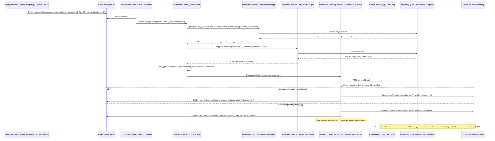

# Спецификация Микросервиса: Notification Service (Сервис Уведомлений)

**Версия:** 1.0
**Дата последнего обновления:** 2024-07-11

## 1. Обзор Сервиса (Overview)

### 1.1. Назначение и Роль
*   **Назначение:** Notification Service отвечает за централизованную, надежную и эффективную доставку всех видов уведомлений пользователям платформы "Российский Аналог Steam" по различным каналам.
*   **Роль в общей архитектуре платформы:** Сервис служит единым центром для отправки транзакционных уведомлений (например, подтверждение регистрации, информация о заказах), системных оповещений (например, о технических работах), маркетинговых рассылок и уведомлений, инициированных другими микросервисами (например, о новых сообщениях, разблокировке достижений). Он абстрагирует сложность взаимодействия с различными провайдерами доставки (Email, Push, SMS) и каналами (In-App), управляет пользовательскими предпочтениями и шаблонами.
*   **Основные бизнес-задачи:**
    *   Обеспечение своевременной и гарантированной доставки критически важных уведомлений.
    *   Повышение вовлеченности пользователей через персонализированные и релевантные уведомления.
    *   Управление пользовательскими подписками и предпочтениями для соблюдения законодательства и повышения удовлетворенности пользователей.
    *   Предоставление инструментов для создания и управления шаблонами уведомлений для консистентности и упрощения.
    *   Поддержка маркетинговых кампаний через целевые рассылки.
    *   Сбор и анализ статистики по доставке и взаимодействию с уведомлениями для оптимизации коммуникаций.
*   Разработка сервиса должна вестись в соответствии с `../../../../CODING_STANDARDS.md`.

### 1.2. Ключевые Функциональности
*   **Многоканальная доставка:**
    *   Email (транзакционные, маркетинговые).
    *   Push-уведомления: Для Android будет использоваться российский сервис push-уведомлений (например, PushPole, RuStore Push SDK, или другой доступный на момент реализации) или соответствующий сервис от российского магазина приложений. Использование Firebase Cloud Messaging (FCM) исключено. Для iOS используется Apple Push Notification Service (APNS) как стандартная платформа Apple (если разрешено).
    *   SMS (для критически важных оповещений, 2FA).
    *   In-App уведомления (через WebSocket Gateway или аналогичный механизм для отображения внутри клиентских приложений).
*   **Управление Шаблонами Уведомлений:**
    *   Создание, редактирование, версионирование и хранение шаблонов.
    *   Поддержка локализации шаблонов на несколько языков.
    *   Использование переменных (плейсхолдеров) для персонализации контента.
    *   Предпросмотр шаблонов.
*   **Управление Пользовательскими Предпочтениями и Подписками:**
    *   API для пользователей для настройки предпочтений по типам уведомлений и каналам доставки (opt-in/opt-out).
    *   Управление глобальными отписками (например, от всех маркетинговых рассылок).
    *   Реализация механизма "Не беспокоить" (Do Not Disturb - DND).
    *   (Опционально) Управление частотой уведомлений (frequency capping).
*   **Поддержка Маркетинговых Кампаний:**
    *   API для создания и управления маркетинговыми кампаниями.
    *   Интеграция с Analytics Service для получения сегментов целевой аудитории.
    *   Планирование времени отправки кампаний.
    *   (Опционально, {{TODO: Уточнить глубину реализации}}) Базовые механизмы для A/B тестирования заголовков/содержимого уведомлений.
*   **Отправка Уведомлений:**
    *   Прием запросов на отправку уведомлений преимущественно через Kafka (для асинхронной обработки).
    *   REST API для прямой отправки одиночных или небольших пакетных уведомлений (например, для административных нужд или тестовых отправок).
    *   Возможность отложенной отправки и установки приоритетов.
*   **Отслеживание Статусов Доставки и Взаимодействия:**
    *   Регистрация статусов: отправлено, доставлено, ошибка доставки, отклонено провайдером.
    *   Отслеживание взаимодействия: открыто (для Email, Push), переход по ссылке.
    *   Обработка обратной связи от провайдеров (bounces, complaints для Email; недействительные токены для Push).
*   **Управление Устройствами Пользователя:**
    *   Регистрация и обновление токенов устройств для Push-уведомлений.
    *   Обработка неактивных/недействительных токенов.
*   **Аналитика и Отчетность:**
    *   Сбор и агрегация статистики по доставке и взаимодействию с уведомлениями в ClickHouse.
    *   Предоставление данных для Analytics Service или Admin Service для построения отчетов.

### 1.3. Основные Технологии
*   **Язык программирования:** Go (версия 1.21+, согласно `../../../../project_technology_stack.md`).
*   **Веб-фреймворк (REST API):** Echo (`github.com/labstack/echo/v4`) (согласно `../../../../PACKAGE_STANDARDIZATION.md`).
*   **gRPC:** `google.golang.org/grpc` (для внутреннего взаимодействия, если потребуется, согласно `../../../../PACKAGE_STANDARDIZATION.md`).
*   **Очереди сообщений (основной способ получения запросов на отправку):** Apache Kafka (клиент `github.com/confluentinc/confluent-kafka-go`, согласно `../../../../PACKAGE_STANDARDIZATION.md`).
*   **Шаблонизатор:** Стандартные пакеты Go `text/template` и `html/template`.
*   **Базы данных:**
    *   PostgreSQL (версия 15+): Для хранения метаданных (шаблоны, кампании, пользовательские предпочтения, токены устройств, краткосрочные логи сообщений для оперативных нужд). Драйвер: GORM (`gorm.io/gorm`) с `gorm.io/driver/postgres` (согласно `../../../../PACKAGE_STANDARDIZATION.md`).
    *   ClickHouse (версия 23.x+): Для хранения и агрегации больших объемов статистики по доставке и взаимодействию с уведомлениями (события доставки, открытия, клики). (согласно `../../../../project_technology_stack.md`).
*   **Кэширование:** Redis (версия 7.0+) для кэширования пользовательских предпочтений, активных шаблонов, счетчиков для rate limiting по провайдерам, временных данных для дедупликации уведомлений. Клиент: `go-redis/redis` (согласно `../../../../PACKAGE_STANDARDIZATION.md`).
*   **Интеграции с внешними провайдерами:** Через их HTTP API (для Email - **приоритетно российские провайдеры, например, SendPulse, Unisender, MailRu Cloud**, SMS - **российские SMS-шлюзы, например, SMSC, SMS.ru**), Push - **российские сервисы для Android, APNS для iOS**).
*   **Управление конфигурацией:** Viper (`github.com/spf13/viper`) (согласно `../../../../PACKAGE_STANDARDIZATION.md`).
*   **Логирование:** Zap (`go.uber.org/zap`) (согласно `../../../../PACKAGE_STANDARDIZATION.md`).
*   **Мониторинг/Трассировка:** OpenTelemetry SDK, Prometheus client (`github.com/prometheus/client_golang`). (согласно `../../../../project_observability_standards.md`).
*   **Инфраструктура:** Docker, Kubernetes.
*   Ссылки на: `../../../../project_technology_stack.md`, `../../../../PACKAGE_STANDARDIZATION.md`, `../../../../project_glossary.md`.

### 1.4. Термины и Определения (Glossary)
*   **Уведомление (Notification):** Информационное сообщение, отправляемое пользователю или системе.
*   **Канал Доставки (Delivery Channel):** Способ, которым уведомление достигает пользователя (Email, Push, SMS, In-App).
*   **Шаблон (Template):** Предопределенная структура сообщения с плейсхолдерами для персонализации.
*   **Провайдер Доставки (Provider):** Внешний сервис, используемый для фактической отправки уведомлений по определенному каналу (например, SendGrid для Email, Firebase Cloud Messaging (FCM) для Push).
*   **Кампания (Notification Campaign):** Организованная рассылка одного или нескольких уведомлений целевой аудитории, обычно в маркетинговых целях.
*   **Токен Устройства (Device Token):** Уникальный идентификатор, используемый для отправки Push-уведомлений на конкретное мобильное устройство.
*   **In-App Уведомление:** Уведомление, отображаемое внутри клиентского приложения платформы (часто через WebSocket).
*   **Предпочтение Уведомлений (Notification Preference):** Настройка пользователя, определяющая, какие типы уведомлений и по каким каналам он согласен получать.
*   Для других общих терминов см. `../../../../project_glossary.md`.

## 2. Внутренняя Архитектура (Internal Architecture)

### 2.1. Общее Описание
*   Notification Service построен с использованием событийно-ориентированной архитектуры (EDA), где большинство запросов на отправку уведомлений поступает через Kafka. Сервис также предоставляет REST API для управления шаблонами, кампаниями, предпочтениями и для некоторых видов прямой отправки.
*   Внутренне сервис следует принципам Чистой Архитектуры, разделяя логику на слои представления, приложения, домена и инфраструктуры.
*   Ключевые компоненты включают: потребители Kafka для входящих запросов, оркестратор уведомлений (определяет канал, применяет шаблон и предпочтения), менеджеры шаблонов и предпочтений, диспетчеры для каждого канала доставки (взаимодействующие с внешними провайдерами), и сборщик статистики.

### 2.2. Диаграмма Архитектуры и Потоков Данных

#### 2.2.1. Общая Архитектура Компонентов
```mermaid
graph TD
    subgraph ExternalSystems ["Внешние Системы и Пользователи"]
        OtherServices["Другие Микросервисы (через Kafka/API)"]
        AdminUsers["Администраторы/Маркетологи (через Admin Panel)"]
        UserClientApp["Клиентское Приложение (для In-App и управления предпочтениями)"]
    end

    subgraph NotificationService ["Notification Service (Чистая Архитектура)"]
        direction TB

        subgraph PresentationLayer [Presentation Layer (Адаптеры Транспорта)]
            KafkaConsumer[Kafka Consumers (для `notification.send.request.v1`)]
            REST_API[REST API (Управление шаблонами, кампаниями, предпочтениями, прямая отправка)]
            GRPC_API_Internal[gRPC API (внутренний, опционально для синхронных запросов от сервисов)]
        end

        subgraph ApplicationLayer [Application Layer (Сценарии Использования)]
            NotificationOrchestrator["Оркестратор Уведомлений (логика выбора канала, шаблона, проверка предпочтений)"]
            TemplateAppSvc["Сервис Управления Шаблонами"]
            PreferenceAppSvc["Сервис Управления Предпочтениями"]
            CampaignAppSvc["Сервис Управления Кампаниями"]
            DispatchingAppSvc["Сервис Диспетчеризации по Каналам"]
            StatusTrackingAppSvc["Сервис Отслеживания Статусов"]
            DeviceManagementAppSvc["Сервис Управления Токенами Устройств"]
        end

        subgraph DomainLayer [Domain Layer (Бизнес-логика и Сущности)]
            Entities["Сущности (NotificationTemplate, UserPreferences, DeviceToken, Campaign, MessageLogEntry)"]
            ValueObjects["Объекты-Значения (EmailAddress, PhoneNumber, NotificationPayload)"]
            DomainEvents["Доменные События (NotificationSent, NotificationFailed, PreferenceUpdated)"]
            RepositoryIntf["Интерфейсы Репозиториев"]
            TemplateEngine["Движок Шаблонизации"]
        end

        subgraph InfrastructureLayer [Infrastructure Layer (Внешние Зависимости и Реализации)"]
            PostgresAdapter["Адаптер PostgreSQL (Шаблоны, Предпочтения, Кампании, Логи)"]
            ClickHouseAdapter["Адаптер ClickHouse (Статистика)"]
            RedisAdapter["Адаптер Redis (Кэш, Счетчики)"]
            KafkaProducer["Продюсер Kafka (Статусы уведомлений)"]
            EmailGatewayClient["Клиент Email Шлюза ({{EMAIL_PROVIDER}})"]
            PushGatewayClientFCM["Клиент FCM (Push)"]
            PushGatewayClientAPNS["Клиент APNS (Push)"]
            SMSGatewayClient["Клиент SMS Шлюза ({{SMS_PROVIDER}})"]
            WebSocketGatewayClient["Клиент WebSocket Gateway (для In-App)"]
            AccountSvcClient["Клиент Account Service (gRPC/REST)"]
        end

        PresentationLayer --> ApplicationLayer
        ApplicationLayer --> DomainLayer
        ApplicationLayer --> InfrastructureLayer
        DomainLayer ----> RepositoryIntf
        InfrastructureLayer -- Implements --> RepositoryIntf
    end

    OtherServices -- События (например, `order.completed`) --> KafkaConsumer
    AdminUsers -- REST API --> REST_API
    UserClientApp -- REST API для предпочтений, WebSocket для In-App --> APIGatewayNotif[API Gateway] -- HTTP/WS --> PresentationLayer


    PostgresAdapter --> DB_PG[(PostgreSQL)]
    ClickHouseAdapter --> DB_CH[(ClickHouse)]
    RedisAdapter --> Cache[(Redis)]
    KafkaProducer --> KafkaBroker[Kafka Message Bus]

    EmailGatewayClient -.-> EmailProviderExt[("Email Провайдер")]
    PushGatewayClientFCM -.-> FCM_Service[("Firebase Cloud Messaging")]
    PushGatewayClientAPNS -.-> APNS_Service[("Apple Push Notification Service")]
    SMSGatewayClient -.-> SMSProviderExt[("SMS Провайдер")]
    WebSocketGatewayClient -.-> WebSocketGW[("WebSocket Gateway")]
    AccountSvcClient --> AccountServiceInt[Account Service]


    classDef layer_boundary fill:#f9f9f9,stroke:#333,stroke-width:2px,color:#333
    classDef component_major fill:#e6f0ff,stroke:#007bff,color:#000
    classDef component_minor fill:#d4edda,stroke:#28a745,color:#000
    classDef datastore fill:#f8d7da,stroke:#dc3545,color:#000
    classDef external_actor fill:#FEF9E7,stroke:#F1C40F,color:#000

    class PresentationLayer,ApplicationLayer,DomainLayer,InfrastructureLayer layer_boundary
    class KafkaConsumer,REST_API,GRPC_API_Internal,NotificationOrchestrator,TemplateAppSvc,PreferenceAppSvc,CampaignAppSvc,DispatchingAppSvc,StatusTrackingAppSvc,DeviceManagementAppSvc,Entities,ValueObjects,DomainEvents,RepositoryIntf,TemplateEngine component_major
    class PostgresAdapter,ClickHouseAdapter,RedisAdapter,KafkaProducer,EmailGatewayClient,PushGatewayClientFCM,PushGatewayClientAPNS,SMSGatewayClient,WebSocketGatewayClient,AccountSvcClient component_minor
    class DB_PG,DB_CH,Cache,KafkaBroker datastore
    class OtherServices,AdminUsers,UserClientApp,APIGatewayNotif,EmailProviderExt,FCM_Service,APNS_Service,SMSProviderExt,WebSocketGW,AccountServiceInt external_actor
```

#### 2.2.2. Последовательность Отправки Уведомления (Event-Triggered)


### 2.3. Слои Сервиса (и Компоненты)
(Описания слоев аналогичны предыдущим сервисам, с акцентом на специфику Notification Service: управление шаблонами, предпочтениями, диспетчеризация по каналам, взаимодействие с внешними провайдерами уведомлений.)

## 3. API Endpoints
(Раздел API как в существующем документе, с уточнениями payload для /send/direct и добавлением примеров для управления кампаниями)

### 3.1.1. Управление Шаблонами Уведомлений
(Как в существующем документе)

### 3.1.2. Управление Пользовательскими Предпочтениями
(Как в существующем документе)

### 3.1.3. Отправка Уведомлений (Прямая, для сервисов/админов)
*   **`POST /send/direct`**
    *   Описание: Прямая отправка уведомления одному или нескольким получателям. Используется для специфических случаев, не покрываемых событийной моделью, или администраторами.
    *   Тело запроса: (Пример из раздела 5.2, `com.platform.notification.send.request.v1`)
    *   Ответ (202 Accepted): `{ "data": { "type": "notificationSendResponse", "id": "message-log-uuid", "status": "queued" } }`

### 3.1.4. Управление Кампаниями (для Администраторов/Маркетологов)
*   **`POST /campaigns`**
    *   Описание: Создание новой кампании уведомлений.
    *   Тело запроса: `{"data": {"type": "notificationCampaignCreation", "attributes": {"name": "Новогодняя Распродажа 2025", "description": "...", "target_segment_id": "active_shoppers_last_3m", "template_name": "new_year_sale_email", "scheduled_at": "2024-12-20T10:00:00Z"}}}`
    *   Ответ (201 Created): (Созданный объект `NotificationCampaign`)
*   **`GET /campaigns`**
    *   Описание: Получение списка кампаний.
*   **`GET /campaigns/{campaign_id}`**
    *   Описание: Получение деталей кампании.
*   **`PUT /campaigns/{campaign_id}`**
    *   Описание: Обновление деталей кампании.
*   **`POST /campaigns/{campaign_id}/schedule`**
    *   Описание: Запланировать или изменить расписание кампании.
*   **`POST /campaigns/{campaign_id}/pause`**
    *   Описание: Приостановить активную кампанию.
*   **`POST /campaigns/{campaign_id}/resume`**
    *   Описание: Возобновить приостановленную кампанию.

## 4. Модели Данных (Data Models)
(ERD и DDL для PostgreSQL, описание ClickHouse и Redis как в существующем документе, с уточнениями).

#### 4.2.2. ClickHouse (Статистика и Долгосрочные Логи Доставки)
*   **Таблица `notification_delivery_events` (или `notification_funnel_events`):** Детальные события жизненного цикла уведомлений.
    *   `event_id` (UUID): Уникальный идентификатор события.
    *   `message_id` (UUID): Идентификатор сообщения из `NotificationMessageLog`.
    *   `user_id` (UUID, Nullable): ID пользователя.
    *   `campaign_id` (UUID, Nullable): ID кампании.
    *   `template_name` (String): Имя шаблона.
    *   `channel_type` (Enum8: 'email'=1, 'push_fcm'=2, 'push_apns'=3, 'sms'=4, 'in_app'=5): Канал доставки.
    *   `provider_name` (String, Nullable): Имя провайдера.
    *   `event_type` (Enum8: 'requested'=1, 'sent'=2, 'delivered'=3, 'failed'=4, 'opened'=5, 'clicked'=6, 'bounced'=7, 'complained'=8, 'unsubscribed_via_notification'=9): Тип события.
    *   `event_timestamp` (DateTime64(3, 'UTC')): Время события.
    *   `recipient_address_hashed` (String): Хешированный адрес получателя (для анализа без раскрытия ПДн).
    *   `status_code_provider` (String, Nullable): Код статуса от провайдера.
    *   `error_message_provider` (String, Nullable): Сообщение об ошибке от провайдера.
    *   `ip_address_client_hashed` (String, Nullable): Хешированный IP адрес клиента при открытии/клике.
    *   `user_agent_client_parsed` (String, Nullable): Обработанный User-Agent клиента.
    *   `link_clicked_url_domain` (String, Nullable): Домен URL, по которому был сделан клик.
    *   `processing_latency_ms` (UInt32, Nullable): Задержка обработки в Notification Service.
    *   `event_date` (Date): Дата события (для партиционирования).
    *   **Engine:** `MergeTree() PARTITION BY toYYYYMM(event_date) ORDER BY (channel_type, template_name, event_type, event_timestamp)`
    *   **Назначение:** Хранение всех событий жизненного цикла уведомлений для анализа воронок, эффективности каналов, шаблонов, кампаний, выявления проблем доставки.

## 5. Потоковая Обработка Событий (Event Streaming)
(Как в существующем документе, с уточнением payload для `com.platform.notification.send.request.v1` и добавлением `notification.opened`, `notification.clicked`).

## 6. Интеграции (Integrations)
(Как в существующем документе).

## 7. Конфигурация (Configuration)
(Как в существующем документе, с акцентом на безопасное управление ключами провайдеров).

## 8. Обработка Ошибок (Error Handling)
(Как в существующем документе).
*   **`TEMPLATE_RENDERING_FAILED`**: Ошибка при обработке шаблона (например, отсутствуют переменные).
*   **`CHANNEL_DISPATCH_FAILED`**: Ошибка при отправке через конкретный канал (после нескольких попыток).
*   **`PROVIDER_API_ERROR`**: Ошибка от внешнего провайдера доставки.
*   **`USER_PREFERENCES_BLOCK_SENDING`**: Отправка заблокирована на основе предпочтений пользователя.
*   **`INVALID_DEVICE_TOKEN`**: Токен устройства недействителен или просрочен.

## 9. Безопасность (Security)
(Как в существующем документе, с акцентом на ФЗ-152 и защиту ПДн в уведомлениях).

## 10. Развертывание (Deployment)
(Как в существующем документе).

## 11. Мониторинг и Логирование (Logging and Monitoring)
(Как в существующем документе).

## 12. Нефункциональные Требования (NFRs)
(Как в существующем документе).

## 13. Приложения (Appendices)
(Как в существующем документе).

## 14. Пользовательские Сценарии (User Flows)

В этом разделе описаны ключевые пользовательские сценарии, связанные с Notification Service.

### 14.1. Отправка Email Подтверждения при Регистрации Пользователя
*   **Описание:** После успешной регистрации пользователя Auth Service отправляет событие, на которое реагирует Notification Service, отправляя письмо с кодом/ссылкой для верификации email.
*   **Диаграмма:** (См. диаграмму "Последовательность Отправки Уведомления (Event-Triggered)" в разделе 2.2.2, она уже покрывает этот сценарий).

### 14.2. Пользователь Получает Push-Уведомление о Скидке на Игру из Списка Желаемого
*   **Описание:** Library Service обнаруживает, что игра из списка желаемого пользователя поступила в продажу со скидкой (например, получив событие от Catalog Service), и инициирует отправку Push-уведомления.
*   **Диаграмма:**
    ```mermaid
    sequenceDiagram
        participant LibrarySvc as Library Service
        participant KafkaBus as Kafka Message Bus
        participant NotifSvc_Consumer as Notification Service (Kafka Consumer)
        participant NotifSvc_Orchestrator as Notification Service (Orchestrator)
        participant NotifSvc_PrefMgr as Notification Service (Preference Manager)
        participant NotifSvc_DeviceMgr as Notification Service (Device Token Manager)
        participant NotifSvc_TplMgr as Notification Service (Template Manager)
        participant NotifSvc_PushDisp as Notification Service (Push Dispatcher)
        participant PushProvider as Push Gateway (FCM/APNS)
        participant UserDevice as Устройство Пользователя

        LibrarySvc->>KafkaBus: Publish `com.platform.notification.send.request.v1`
        Note right of LibrarySvc: Payload: {userId, templateName:"wishlist_sale_push", payloadVariables:{gameName, discount}}
        NotifSvc_Consumer->>KafkaBus: Consume event
        NotifSvc_Consumer->>NotifSvc_Orchestrator: Передача NotificationRequest

        NotifSvc_Orchestrator->>NotifSvc_PrefMgr: Проверить предпочтения (userId, type='wishlist_updates', channel='push')
        NotifSvc_PrefMgr-->>NotifSvc_Orchestrator: Пользователь подписан

        NotifSvc_Orchestrator->>NotifSvc_DeviceMgr: Получить активные токены устройств (userId, platform)
        NotifSvc_DeviceMgr-->>NotifSvc_Orchestrator: Список токенов (e.g., FCM_token)

        NotifSvc_Orchestrator->>NotifSvc_TplMgr: Загрузить шаблон (name='wishlist_sale_push', lang)
        NotifSvc_TplMgr-->>NotifSvc_Orchestrator: Шаблон
        NotifSvc_Orchestrator->>NotifSvc_Orchestrator: Рендеринг шаблона

        loop Для каждого токена устройства
            NotifSvc_Orchestrator->>NotifSvc_PushDisp: Отправить Push (FCM_token, title, body)
            NotifSvc_PushDisp->>PushProvider: API Call: Send Push Notification
            PushProvider-->>NotifSvc_PushDisp: Ответ (успех/ошибка)
            NotifSvc_PushDisp->>NotifSvc_Orchestrator: Статус отправки
        end
        NotifSvc_Orchestrator->>KafkaBus: Publish `com.platform.notification.message.status.updated.v1`
        PushProvider->>UserDevice: Push-уведомление
    ```

### 14.3. Маркетолог Создает и Запускает Кампанию Уведомлений
*   **Описание:** Маркетолог через Admin Panel создает кампанию для анонса новой игры, выбирает сегмент аудитории, шаблон и время запуска.
*   **Диаграмма:**
    ```mermaid
    sequenceDiagram
        actor Marketer as Маркетолог
        participant AdminPanel as Admin Panel UI
        participant NotifSvc_API as Notification Service (REST API)
        participant NotifSvc_CampaignMgr as Notification Service (Campaign Manager)
        participant NotifSvc_Scheduler as Notification Service (Scheduler)
        participant AnalyticsSvc as Analytics Service
        participant KafkaBus as Kafka Message Bus

        Marketer->>AdminPanel: Создает кампанию (название, описание, сегмент "early_adopters", шаблон "new_release_email", время запуска)
        AdminPanel->>NotifSvc_API: POST /api/v1/notifications/campaigns (данные кампании)
        NotifSvc_API->>NotifSvc_CampaignMgr: Создать/Обновить кампанию (status: 'scheduled')
        NotifSvc_CampaignMgr-->>NotifSvc_API: HTTP 201 Created (campaign_id)
        NotifSvc_API-->>AdminPanel: Кампания создана и запланирована

        NotifSvc_Scheduler->>NotifSvc_Scheduler: (В назначенное время) Запуск кампании (campaign_id)
        NotifSvc_Scheduler->>NotifSvc_CampaignMgr: Обновить статус кампании на 'active'
        NotifSvc_CampaignMgr->>KafkaBus: Publish `com.platform.notification.campaign.status.changed.v1` (status: 'active')
        NotifSvc_CampaignMgr->>AnalyticsSvc: (gRPC/REST) Запросить список пользователей в сегменте "early_adopters"
        AnalyticsSvc-->>NotifSvc_CampaignMgr: Список user_id

        loop Для каждого user_id в сегменте
            NotifSvc_CampaignMgr->>KafkaBus: Publish `com.platform.notification.send.request.v1` (userId, templateName="new_release_email", payloadVariables={...}, campaignId)
        end
        Note over NotifSvc_CampaignMgr: Дальнейшая обработка каждого запроса идет по стандартному флоу (см. 14.1).
    ```

### 14.4. Пользователь Обновляет Свои Предпочтения Уведомлений
*   **Описание:** Пользователь через настройки в клиентском приложении отписывается от маркетинговых email-рассылок, но оставляет включенными уведомления о системных событиях.
*   **Диаграмма:**
    ```mermaid
    sequenceDiagram
        actor User
        participant ClientApp as Клиентское Приложение
        participant APIGW as API Gateway
        participant NotifSvc_API as Notification Service (REST API)
        participant NotifSvc_PrefMgr as Notification Service (Preference Manager)
        participant UserDB_PG as PostgreSQL (User Preferences)

        User->>ClientApp: Открывает Настройки -> Уведомления
        ClientApp->>APIGW: GET /api/v1/notifications/preferences/users/me
        APIGW->>NotifSvc_API: Forward request
        NotifSvc_API->>NotifSvc_PrefMgr: Получить текущие предпочтения (userId)
        NotifSvc_PrefMgr->>UserDB_PG: Запрос
        UserDB_PG-->>NotifSvc_PrefMgr: Предпочтения
        NotifSvc_PrefMgr-->>NotifSvc_API: Текущие предпочтения
        NotifSvc_API-->>APIGW: HTTP 200 OK
        APIGW-->>ClientApp: HTTP 200 OK
        ClientApp-->>User: Отображение текущих настроек

        User->>ClientApp: Снимает галочку "Маркетинговые Email", оставляет "Системные Email"
        ClientApp->>APIGW: PUT /api/v1/notifications/preferences/users/me (payload: { "type_preferences": {"marketing_email": {"email": false}}, "channel_settings": {"email": {"enabled": true}} })
        APIGW->>NotifSvc_API: Forward request
        NotifSvc_API->>NotifSvc_PrefMgr: Обновить предпочтения (userId, новые настройки)
        NotifSvc_PrefMgr->>UserDB_PG: Сохранение изменений
        NotifSvc_PrefMgr->>RedisCacheNotif: (Опционально) Инвалидация кэша предпочтений для пользователя
        NotifSvc_PrefMgr-->>NotifSvc_API: Успех/ошибка
        NotifSvc_API-->>APIGW: HTTP 200 OK
        APIGW-->>ClientApp: HTTP 200 OK
        ClientApp-->>User: Настройки сохранены
    ```

### 14.5. Notification Service Обрабатывает Пакет Уведомлений и Логирует Статусы
*   **Описание:** Сервис обрабатывает очередь запросов из Kafka, отправляет уведомления через внешних провайдеров и записывает результаты в статистику.
*   **Диаграмма:**
    ```mermaid
    graph LR
        subgraph Kafka
            TopicSendRequest["com.platform.notification.send.request.v1"]
        end
        subgraph NotificationService
            Consumer["Kafka Consumer"]
            Orchestrator["Notification Orchestrator"]
            Dispatchers["Channel Dispatchers (Email, Push, SMS)"]
            StatsAggregator["Stats Aggregator / Logger"]
        end
        subgraph ExternalDependencies
            Providers["External Providers (Email, Push, SMS GW)"]
            ClickHouseDB["ClickHouse (Stats)"]
            PostgresDB_Logs["PostgreSQL (Short-term Logs)"]
            Kafka_StatusTopic["com.platform.notification.events.v1 (Status Updates)"]
        end

        TopicSendRequest --> Consumer;
        Consumer --> Orchestrator;
        Orchestrator --> Dispatchers;
        Dispatchers --> Providers;
        Providers -- Delivery Status --> Dispatchers;
        Dispatchers -- Processed Status --> StatsAggregator;
        StatsAggregator --> ClickHouseDB;
        StatsAggregator --> PostgresDB_Logs;
        StatsAggregator --> Kafka_StatusTopic;

        Orchestrator --> PostgresDB_Logs : "Логирование запроса и промежуточных статусов";
        Orchestrator --> RedisCacheNotif [Redis Cache (Preferences, Templates)];
        RedisCacheNotif -.-> Orchestrator;
    ```

## 15. Резервное Копирование и Восстановление (Backup and Recovery)
(Как в предыдущем моем ответе).

## 16. Приложения (Appendices)
(Как в предыдущем моем ответе).

## 17. Связанные Рабочие Процессы (Related Workflows)
(Как в предыдущем моем ответе, с добавлением плейсхолдеров для новых воркфлоу).
*   [Регистрация пользователя и начальная настройка профиля](../../../../project_workflows/user_registration_flow.md)
*   [Процесс покупки игры и обновления библиотеки пользователя](../../../../project_workflows/game_purchase_flow.md)
*   [Процесс подачи разработчиком новой игры на модерацию](../../../../project_workflows/game_submission_flow.md)
*   [Процесс сброса и восстановления пароля](../../../../project_workflows/password_reset_flow.md) <!-- {{TODO: Workflow будет создан и описан в project_workflows/password_reset_flow.md}} -->
*   [Уведомление пользователя о скидке на игру из списка желаемого](../../../../project_workflows/wishlist_sale_notification_flow.md) <!-- {{TODO: Workflow будет создан и описан в project_workflows/wishlist_sale_notification_flow.md}} -->

---
*Этот документ является основной спецификацией для Notification Service и должен поддерживаться в актуальном состоянии.*
