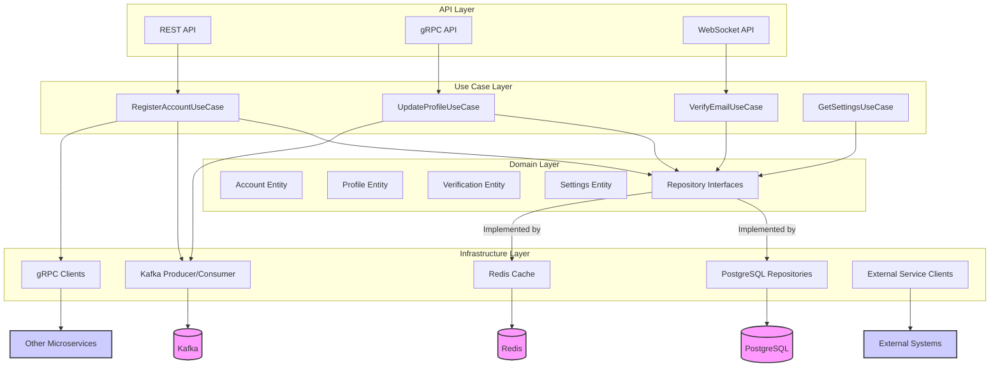
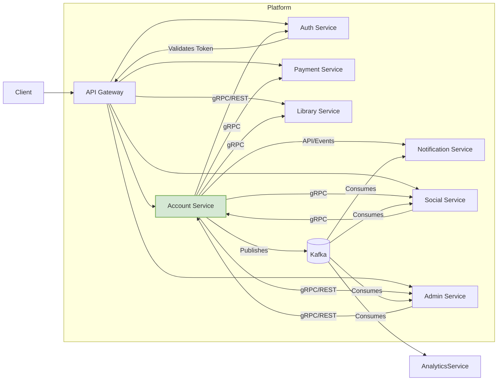

# Спецификация микросервиса "Account Service"

**Версия:** 1.0
**Дата:** 2025-05-24

## Содержание

1.  [Введение](#1-введение)
    1.1. [Назначение документа](#11-назначение-документа)
    1.2. [Область применения](#12-область-применения)
    1.3. [Глоссарий](#13-глоссарий)
    1.4. [Ссылки](#14-ссылки)
2.  [Требования и цели](#2-требования-и-цели)
    2.1. [Назначение и роль в системе](#21-назначение-и-роль-в-системе)
    2.2. [Основные функциональные требования](#22-основные-функциональные-требования)
    2.3. [Нефункциональные требования](#23-нефункциональные-требования)
    2.4. [Ключевые метрики и KPI](#24-ключевые-метрики-и-kpi)
    2.5. [Ограничения и допущения](#25-ограничения-и-допущения)
3.  [Архитектура](#3-архитектура)
    3.1. [Общая архитектура микросервиса](#31-общая-архитектура-микросервиса)
    3.2. [Технологический стек](#32-технологический-стек)
    3.3. [Модель данных](#33-модель-данных)
    3.4. [Взаимодействие с другими микросервисами](#34-взаимодействие-с-другими-микросервисами)
    3.5. [Схема развертывания](#35-схема-развертывания)
4.  [Бизнес-логика и сценарии использования](#4-бизнес-логика-и-сценарии-использования)
    4.1. [Управление Аккаунтами (Accounts)](#41-управление-аккаунтами-accounts)
    4.2. [Управление Профилями Пользователей (User Profiles)](#42-управление-профилями-пользователей-user-profiles)
    4.3. [Верификация Пользователей (User Verification)](#43-верификация-пользователей-user-verification)
    4.4. [Управление Настройками (Settings Management)](#44-управление-настройками-settings-management)
5.  [Структура данных и API](#5-структура-данных-и-api)
    5.1. [REST API](#51-rest-api)
    5.2. [gRPC API](#52-grpc-api)
    5.3. [WebSocket API](#53-websocket-api)
    5.4. [События (Events)](#54-события-events)
    5.5. [Форматы данных](#55-форматы-данных)
    5.6. [Обработка ошибок](#56-обработка-ошибок)
6.  [Интеграции с другими микросервисами и внешними системами](#6-интеграции-с-другими-микросервисами-и-внешними-системами)
    6.1. [Интеграции с микросервисами платформы](#61-интеграции-с-микросервисами-платформы)
    6.2. [Интеграции с внешними системами](#62-интеграции-с-внешними-системами)
7.  [Безопасность и авторизация](#7-безопасность-и-авторизация)
    7.1. [Аутентификация](#71-аутентификация)
    7.2. [Авторизация (RBAC)](#72-авторизация-rbac)
    7.3. [Защита данных](#73-защита-данных)
    7.4. [Управление секретами](#74-управление-секретами)
    7.5. [Защита от атак](#75-защита-от-атак)
8.  [Мониторинг, логирование и трассировка](#8-мониторинг-логирование-и-трассировка)
    8.1. [Мониторинг и алертинг](#81-мониторинг-и-алертинг)
    8.2. [Логирование](#82-логирование)
    8.3. [Трассировка](#83-трассировка)
    8.4. [Аудит](#84-аудит)
9.  [Реализация и развертывание](#9-реализация-и-развертывание)
    9.1. [Инфраструктурные файлы](#91-инфраструктурные-файлы)
    9.2. [Конфигурационные параметры](#92-конфигурационные-параметры)
    9.3. [CI/CD](#93-cicd)
    9.4. [Управление состоянием](#94-управление-состоянием)
10. [Приложения](#10-приложения)
    10.1. [Матрица доступа](#101-матрица-доступа)

## 1. Введение

### 1.1 Назначение документа

Данный документ представляет собой полную спецификацию микросервиса "Account Service" для российского аналога платформы Steam. Он описывает назначение, архитектуру, функциональные возможности, структуру данных, API, интеграции и нефункциональные требования, необходимые для реализации и эксплуатации сервиса управления Аккаунтами (Accounts) и Профилями Пользователей (User Profiles). Спецификация предназначена для архитекторов, разработчиков (backend на Go, frontend на Flutter), DevOps-инженеров, QA-инженеров и менеджеров проекта, обеспечивая единое понимание роли и устройства данного фундаментального компонента платформы в соответствии с утвержденными стандартами.

### 1.2 Область применения

Account Service является корневым микросервисом платформы, отвечающим за управление Аккаунтами Пользователей (User Accounts), Профилями Пользователей (User Profiles) и связанными с ними данными (настройки, верификации, контактная информация). Он предоставляет базовую функциональность для регистрации, хранения и управления информацией о Пользователях (Users), которая используется другими сервисами платформы. Данная спецификация определяет границы ответственности сервиса, его взаимодействие с другими компонентами системы и технические аспекты реализации, соответствующие единым стандартам и глоссарию.

### 1.3 Глоссарий

В данном разделе приведены основные термины и определения, используемые в спецификации, в соответствии с "Единым глоссарием терминов и определений для российского аналога Steam".

*   **Аккаунт (Account)**: Учетная запись Пользователя (User) в системе, содержащая базовую информацию, необходимую для его идентификации и аутентификации. Связана с одним или несколькими методами аутентификации.
*   **Пользователь (User)**: Субъект, взаимодействующий с платформой. Может иметь различные Роли (Roles) и Разрешения (Permissions).
*   **Профиль пользователя (User Profile)**: Набор публичной или частично публичной информации о Пользователе (User), которая может быть доступна другим Пользователям (Users) платформы (например, Отображаемое имя (Nickname), Изображение профиля (Avatar), информация о себе).
*   **Имя пользователя (Username)**: Уникальный идентификатор Пользователя (User), используемый для входа в систему.
*   **Отображаемое имя (Nickname)**: Имя, которое отображается другим Пользователям (Users) платформы.
*   **Изображение профиля (Avatar)**: Графическое изображение, представляющее Пользователя (User) на платформе.
*   **Роль (Role)**: Набор Разрешений (Permissions), определяющий возможности Пользователя (User) в системе (например, `user`, `admin`, `developer`). Определены в "Едином реестре ролей пользователей и матрице доступа".
*   **Разрешение (Permission)**: Право на выполнение определенного действия в системе (например, `account:read`, `profile:update`).
*   **Сессия (Session)**: Период активности Пользователя (User) в системе между входом и выходом, ассоциированный с Токеном доступа (Access Token).
*   **Токен доступа (Access Token)**: Краткосрочный криптографический токен (обычно JWT), используемый для аутентификации и авторизации Пользователя (User) при обращении к API.
*   **Токен обновления (Refresh Token)**: Долгосрочный криптографический токен, используемый для безопасного получения нового Токена доступа (Access Token) без повторной аутентификации.
*   **Двухфакторная аутентификация (2FA)**: Метод идентификации Пользователя (User), требующий предоставления двух различных типов данных (факторов) для подтверждения личности (например, пароль + код из приложения).
*   **Верификация (Verification)**: Процесс подтверждения подлинности данных, предоставленных Пользователем (User) (например, email, номер телефона).
*   **Событие (Event)**: Сообщение, описывающее произошедшее в системе действие (например, `account.created`), публикуемое в брокере сообщений (Kafka) в формате CloudEvents.
*   **API (Application Programming Interface)**: Интерфейс взаимодействия между программными компонентами. Включает REST API, gRPC API, WebSocket API.
*   **REST API**: API, основанный на принципах Representational State Transfer, использующий HTTP-методы и JSON.
*   **gRPC API**: Высокопроизводительный RPC-фреймворк для межсервисного взаимодействия, использующий Protocol Buffers.
*   **WebSocket API**: API для двунаправленной связи в реальном времени между клиентом и сервером.
*   **Go**: Язык программирования, используемый для разработки backend.
*   **Flutter**: Фреймворк для разработки кроссплатформенных frontend-приложений (используется для клиентской части).
*   **PostgreSQL**: Реляционная система управления базами данных.
*   **Redis**: Хранилище данных типа "ключ-значение", используемое для кэширования и управления Сессиями (Sessions).
*   **Kafka**: Распределенная платформа потоковой передачи событий, используемая как брокер сообщений.
*   **Docker**: Платформа для контейнеризации приложений.
*   **Kubernetes (K8s)**: Система оркестрации контейнеров.
*   **Prometheus**: Система мониторинга и сбора метрик.
*   **Grafana**: Платформа для визуализации метрик.
*   **ELK Stack (Elasticsearch, Logstash, Kibana)**: Стек технологий для сбора, обработки и визуализации логов.
*   **Jaeger**: Система распределенной трассировки.
*   **JWT (JSON Web Token)**: Стандарт для создания токенов доступа, используемых для передачи информации между сторонами в виде JSON-объекта.
*   **RBAC (Role-Based Access Control)**: Модель управления доступом на основе ролей.
*   **CloudEvents**: Спецификация для описания данных событий в едином формате.

### 1.4 Ссылки

*   [Единый глоссарий терминов и определений для российского аналога Steam.txt]
*   [Единый реестр ролей пользователей и матрица доступа.txt]
*   [Стандарты API, форматов данных, событий и конфигурационных файлов.txt]
*   [Стандартизация технологического стека микросервисов.txt]
*   [Стандарты безопасности, мониторинга, логирования и трассировки.txt]
*   [Стандарты инфраструктурных файлов для продакшен-развертывания.txt]
*   [Спецификация микросервиса Library Service.md] (Эталонная спецификация)
*   [Аудит интеграций между микросервисами.txt]
*   [Отчет о несоответствиях и несогласованностях в спецификациях микросервисов.txt]

## 2. Требования и цели

### 2.1 Назначение и роль в системе

Account Service является фундаментальным компонентом российского аналога Steam, отвечающим за управление Аккаунтами (Accounts) и Профилями Пользователей (User Profiles). Этот микросервис хранит и обрабатывает базовую информацию о Пользователях (Users), которая используется всеми остальными сервисами платформы (Auth Service, Social Service, Library Service, Payment Service и др.). Он выступает в качестве единого источника достоверной информации о Пользователях (Users) и обеспечивает целостность, согласованность и безопасность данных Аккаунтов (Accounts) и Профилей (Profiles).

Основные задачи сервиса:
*   Регистрация и управление жизненным циклом Аккаунтов (Accounts).
*   Хранение и управление данными Профилей Пользователей (User Profiles).
*   Управление контактной информацией и ее верификация.
*   Управление настройками Пользователей (Users).
*   Предоставление API для доступа к данным Аккаунтов (Accounts) и Профилей (Profiles) другим микросервисам и frontend-клиентам (Flutter).
*   Генерация Событий (Events) об изменениях состояния Аккаунтов (Accounts) и Профилей (Profiles).

### 2.2 Основные функциональные требования

1.  **Управление Аккаунтами (Accounts)**:
    *   Регистрация новых Аккаунтов (Accounts) с использованием различных методов (email/пароль, социальные сети, Telegram).
    *   Хранение и управление базовой информацией Аккаунта (Account) (ID, Username, статус, даты).
    *   Обновление статуса Аккаунта (Account) (активный, неактивный, заблокированный, удаленный).
    *   Блокировка/разблокировка Аккаунтов (Accounts) администраторами.
    *   Удаление Аккаунтов (Accounts) (мягкое удаление с анонимизацией данных).
    *   Поиск Аккаунтов (Accounts) по различным критериям (ID, Username, email).

2.  **Управление Профилями Пользователей (User Profiles)**:
    *   Создание Профиля (Profile) при регистрации Аккаунта (Account).
    *   Редактирование данных Профиля (Profile) (Nickname, bio, страна, город, дата рождения, пол).
    *   Управление Изображениями профиля (Avatar) и баннерами (загрузка, удаление, выбор текущего).
    *   Настройка видимости Профиля (Profile) и отдельных его полей (публичный, только для друзей, приватный).
    *   Отслеживание и предоставление истории изменений Профиля (Profile).

3.  **Верификация Пользователей (User Verification)**:
    *   Управление контактной информацией (email, телефон).
    *   Запрос и подтверждение верификации email.
    *   Запрос и подтверждение верификации номера телефона (через SMS).
    *   Управление статусами верификации.
    *   Отслеживание истории верификаций и попыток.

4.  **Управление Настройками (Settings Management)**:
    *   Хранение и обновление пользовательских настроек по категориям (например, приватность, уведомления, интерфейс, безопасность).
    *   Предоставление API для получения и изменения настроек.

### 2.3 Нефункциональные требования

1.  **Производительность**:
    *   Время отклика API (P95): < 100 мс для чтения, < 200 мс для записи.
    *   Время отклика API (P99): < 200 мс для чтения, < 400 мс для записи.
    *   Пропускная способность: не менее 2000 запросов в секунду (RPS) на чтение, не менее 500 RPS на запись.
    *   Время регистрации нового Аккаунта (Account) (P99): < 500 мс.

2.  **Надежность**:
    *   Доступность (Availability): 99.99%.
    *   Время восстановления после сбоя (RTO): < 5 минут.
    *   Допустимая точка восстановления (RPO): < 1 минута.
    *   Обеспечение отказоустойчивости за счет репликации и резервирования.

3.  **Масштабируемость**:
    *   Поддержка не менее 10 миллионов активных Аккаунтов (Accounts) с возможностью роста до 50 миллионов.
    *   Горизонтальное масштабирование компонентов сервиса (API Layer, Service Layer).
    *   Масштабирование базы данных (шардирование, репликация чтения).
    *   Эффективное использование ресурсов (CPU, память) при росте нагрузки.

4.  **Безопасность**:
    *   Соответствие требованиям ФЗ-152 "О персональных данных".
    *   Шифрование чувствительных данных в покое и при передаче.
    *   Защита от распространенных веб-уязвимостей (OWASP Top 10).
    *   Реализация безопасной аутентификации и авторизации.
    *   Регулярное сканирование на уязвимости.

5.  **Сопровождаемость (Maintainability)**:
    *   Чистый, хорошо документированный код на Go.
    *   Модульная архитектура.
    *   Покрытие кода тестами (unit, integration) не менее 80%.
    *   Наличие CI/CD пайплайнов.
    *   Стандартизированное логирование и мониторинг.

6.  **Совместимость**:
    *   Совместимость API с frontend-клиентом на Flutter.
    *   Совместимость API и форматов событий с другими микросервисами платформы.
    *   Совместимость с российскими системами верификации (если применимо).

### 2.4 Ключевые метрики и KPI

*   **Технические метрики**:
    *   Время отклика API (latency P95, P99).
    *   Пропускная способность API (RPS).
    *   Уровень ошибок API (% ошибок).
    *   Доступность сервиса (uptime %).
    *   Использование ресурсов (CPU, RAM, disk I/O, network).
    *   Задержка репликации базы данных.
    *   Задержка обработки событий в Kafka.
*   **Бизнес-метрики**:
    *   Количество зарегистрированных Аккаунтов (Accounts).
    *   Количество активных Аккаунтов (Accounts) (DAU, MAU).
    *   Коэффициент успешной верификации (email, телефон).
    *   Время, затрачиваемое Пользователем (User) на редактирование Профиля (Profile).

### 2.5 Ограничения и допущения

*   **Ограничения**:
    *   Сервис должен работать в инфраструктуре Kubernetes.
    *   Используемый технологический стек должен соответствовать "Стандартизации технологического стека микросервисов".
    *   Все API и форматы данных должны соответствовать "Стандартам API, форматов данных, событий и конфигурационных файлов".
    *   Требования безопасности должны соответствовать "Стандартам безопасности, мониторинга, логирования и трассировки".
    *   Необходимо обеспечить хранение данных на территории РФ согласно законодательству.
*   **Допущения**:
    *   Auth Service предоставляет необходимый функционал для аутентификации и управления учетными данными.
    *   Notification Service доступен для отправки уведомлений (email, SMS).
    *   Инфраструктура (Kubernetes, Kafka, PostgreSQL, Redis) предоставляется и поддерживается платформенной командой.
    *   Существуют внешние сервисы для верификации телефона (SMS-шлюз).


## 3. Архитектура

### 3.1 Общая архитектура микросервиса

Account Service построен на принципах чистой архитектуры (Clean Architecture) и микросервисного подхода. Он состоит из следующих слоев:

1.  **API Layer (Интерфейсный слой)**: Отвечает за обработку входящих запросов (REST, gRPC, WebSocket), валидацию данных, преобразование DTO (Data Transfer Objects) и вызов соответствующей бизнес-логики. Использует фреймворк Gin или Echo для REST, стандартные библиотеки Go для gRPC и Gorilla WebSocket для WebSocket.
2.  **Use Case Layer (Слой сценариев использования)**: Содержит основную бизнес-логику сервиса, оркестрируя взаимодействие между различными компонентами и репозиториями для выполнения конкретных сценариев (например, регистрация Аккаунта, обновление Профиля).
3.  **Domain Layer (Доменный слой)**: Содержит основные доменные сущности (Аккаунт, Профиль, Верификация, Настройки), их бизнес-правила и интерфейсы репозиториев.
4.  **Infrastructure Layer (Инфраструктурный слой)**: Реализует интерфейсы репозиториев, взаимодействуя с базами данных (PostgreSQL), кэшем (Redis), брокером сообщений (Kafka) и другими внешними сервисами. Также включает клиенты для взаимодействия с другими микросервисами.

#### Диаграмма слоев (Clean Architecture)



### 3.2 Технологический стек

Технологический стек выбран в соответствии со "Стандартизацией технологического стека микросервисов".

1.  **Backend**:
    *   **Язык программирования**: Go (версия 1.21+)
    *   **Web Framework (REST)**: Gin или Echo (предпочтительно Gin)
    *   **gRPC Framework**: google.golang.org/grpc
    *   **WebSocket**: Gorilla WebSocket
    *   **ORM/DB Driver**: GORM или sqlx (предпочтительно GORM для простоты, sqlx для производительности)
    *   **Миграции БД**: golang-migrate/migrate
    *   **Валидация**: go-playground/validator
    *   **Логирование**: Zap или Logrus (согласно стандарту)
    *   **Метрики**: prometheus/client_golang
    *   **Трассировка**: go.opentelemetry.io/otel
    *   **JWT**: golang-jwt/jwt/v5
    *   **RBAC**: Casbin (опционально, если требуется сложная логика)
    *   **Клиент Kafka**: confluent-kafka-go или sarama
    *   **Клиент Redis**: go-redis/redis

2.  **Frontend (Клиент)**:
    *   **Фреймворк**: Flutter
    *   **Язык программирования**: Dart
    *   **Управление состоянием**: Provider/Riverpod/Bloc (согласно стандарту команды frontend)
    *   **HTTP-клиент**: Dio
    *   **gRPC-клиент**: grpc-dart
    *   **WebSocket-клиент**: web_socket_channel
    *   **Локальное хранилище**: Hive/Drift/SharedPreferences

3.  **Хранение данных**:
    *   **Основная СУБД**: PostgreSQL (версия 15+)
    *   **Кэш / Управление сессиями**: Redis
    *   **Брокер сообщений**: Kafka

4.  **Инфраструктура**:
    *   **Контейнеризация**: Docker
    *   **Оркестрация**: Kubernetes (K8s)
    *   **CI/CD**: GitLab CI (или согласно стандарту платформы)
    *   **Управление релизами**: Helm
    *   **Мониторинг**: Prometheus + Grafana + Alertmanager
    *   **Логирование**: ELK Stack (Elasticsearch, Logstash, Kibana) или EFK (Elasticsearch, Fluentd, Kibana)
    *   **Трассировка**: Jaeger
    *   **API Gateway**: Kong, KrakenD или собственный на Go (согласно стандарту платформы)

### 3.3 Модель данных

#### 3.3.1 Основные сущности (Domain Entities)

*   **Account**: Базовая информация об Аккаунте (ID, Username, Status, Timestamps).
*   **AuthMethod**: Способ аутентификации, связанный с Аккаунтом (ID, AccountID, Type (password, google, telegram), Identifier, IsVerified, Timestamps).
*   **Profile**: Расширенная информация Профиля Пользователя (ID, AccountID, Nickname, Bio, Country, City, BirthDate, Gender, Visibility, AvatarURL, BannerURL, Timestamps).
*   **ContactInfo**: Контактная информация (ID, AccountID, Type (email, phone), Value, IsPrimary, IsVerified, VerificationCode, VerificationAttempts, VerificationExpiresAt, Visibility, Timestamps).
*   **Setting**: Пользовательские настройки (ID, AccountID, Category, SettingsJSON, Timestamps).
*   **Avatar**: Загруженные изображения профиля (ID, AccountID, URL, IsCurrent, Timestamps).
*   **ProfileHistory**: История изменений Профиля (ID, ProfileID, FieldName, OldValue, NewValue, ChangedByAccountID, ChangedAt).

#### 3.3.2 Схема базы данных (PostgreSQL)

```sql
-- Аккаунты
CREATE TABLE accounts (
    id UUID PRIMARY KEY DEFAULT gen_random_uuid(),
    username VARCHAR(64) NOT NULL UNIQUE,
    status VARCHAR(20) NOT NULL DEFAULT 'pending', -- pending, active, blocked, deleted
    created_at TIMESTAMPTZ NOT NULL DEFAULT now(),
    updated_at TIMESTAMPTZ,
    deleted_at TIMESTAMPTZ -- Для мягкого удаления
);
CREATE INDEX idx_accounts_username ON accounts(username);
CREATE INDEX idx_accounts_status ON accounts(status);

-- Методы аутентификации
CREATE TABLE auth_methods (
    id UUID PRIMARY KEY DEFAULT gen_random_uuid(),
    account_id UUID NOT NULL REFERENCES accounts(id) ON DELETE CASCADE,
    type VARCHAR(20) NOT NULL, -- password, google, telegram, etc.
    identifier VARCHAR(255) NOT NULL, -- email для password, google_id для google, telegram_id для telegram
    secret TEXT, -- Хэш пароля для type='password'
    is_verified BOOLEAN NOT NULL DEFAULT false,
    created_at TIMESTAMPTZ NOT NULL DEFAULT now(),
    updated_at TIMESTAMPTZ,
    UNIQUE (type, identifier)
);
CREATE INDEX idx_auth_methods_account_id ON auth_methods(account_id);

-- Профили пользователей
CREATE TABLE profiles (
    id UUID PRIMARY KEY DEFAULT gen_random_uuid(),
    account_id UUID NOT NULL UNIQUE REFERENCES accounts(id) ON DELETE CASCADE,
    nickname VARCHAR(64) UNIQUE,
    bio TEXT,
    country CHAR(2), -- ISO 3166-1 alpha-2
    city VARCHAR(100),
    birth_date DATE,
    gender VARCHAR(10), -- male, female, other
    visibility VARCHAR(20) NOT NULL DEFAULT 'public', -- public, friends_only, private
    avatar_url TEXT,
    banner_url TEXT,
    created_at TIMESTAMPTZ NOT NULL DEFAULT now(),
    updated_at TIMESTAMPTZ
);
CREATE INDEX idx_profiles_nickname ON profiles(nickname);

-- Контактная информация (Email, Phone)
CREATE TABLE contact_info (
    id UUID PRIMARY KEY DEFAULT gen_random_uuid(),
    account_id UUID NOT NULL REFERENCES accounts(id) ON DELETE CASCADE,
    type VARCHAR(10) NOT NULL, -- email, phone
    value VARCHAR(255) NOT NULL,
    is_primary BOOLEAN NOT NULL DEFAULT false,
    is_verified BOOLEAN NOT NULL DEFAULT false,
    verification_code VARCHAR(10),
    verification_attempts INT DEFAULT 0,
    verification_expires_at TIMESTAMPTZ,
    visibility VARCHAR(20) NOT NULL DEFAULT 'private', -- public, friends_only, private
    created_at TIMESTAMPTZ NOT NULL DEFAULT now(),
    updated_at TIMESTAMPTZ,
    UNIQUE (account_id, type, value),
    UNIQUE (account_id, type, is_primary) WHERE is_primary = true -- Только один основной email/телефон
);
CREATE INDEX idx_contact_info_value ON contact_info(value);

-- Настройки пользователей
CREATE TABLE user_settings (
    id UUID PRIMARY KEY DEFAULT gen_random_uuid(),
    account_id UUID NOT NULL REFERENCES accounts(id) ON DELETE CASCADE,
    category VARCHAR(50) NOT NULL, -- privacy, notifications, interface, security
    settings JSONB NOT NULL,
    created_at TIMESTAMPTZ NOT NULL DEFAULT now(),
    updated_at TIMESTAMPTZ,
    UNIQUE (account_id, category)
);

-- Аватары
CREATE TABLE avatars (
    id UUID PRIMARY KEY DEFAULT gen_random_uuid(),
    account_id UUID NOT NULL REFERENCES accounts(id) ON DELETE CASCADE,
    url TEXT NOT NULL,
    is_current BOOLEAN NOT NULL DEFAULT false,
    created_at TIMESTAMPTZ NOT NULL DEFAULT now()
);
CREATE INDEX idx_avatars_account_id ON avatars(account_id);

-- История изменений профилей
CREATE TABLE profile_history (
    id BIGSERIAL PRIMARY KEY,
    profile_id UUID NOT NULL REFERENCES profiles(id) ON DELETE CASCADE,
    field_name VARCHAR(50) NOT NULL,
    old_value TEXT,
    new_value TEXT,
    changed_by_account_id UUID REFERENCES accounts(id), -- NULL если изменено системой
    changed_at TIMESTAMPTZ NOT NULL DEFAULT now()
);
CREATE INDEX idx_profile_history_profile_id ON profile_history(profile_id);
```

*Примечание: Схема может потребовать доработки, включая добавление индексов для часто используемых запросов и оптимизацию типов данных.* 

### 3.4 Взаимодействие с другими микросервисами

Account Service активно взаимодействует с другими компонентами платформы:

*   **Auth Service**: 
    *   Account Service делегирует создание и проверку учетных данных (паролей, сессий) Auth Service.
    *   При регистрации Аккаунта (Account) отправляет запрос в Auth Service для создания записи аутентификации.
    *   Получает информацию о статусе аутентификации Пользователя (User) от Auth Service (через API Gateway или напрямую).
*   **Notification Service**: 
    *   Публикует События (Events) (например, `verification.code.sent`, `account.blocked`) или напрямую вызывает API Notification Service для отправки email и SMS уведомлений Пользователям (Users).
*   **Social Service**: 
    *   Предоставляет данные Профилей (Profiles) по запросу от Social Service (через gRPC).
    *   Получает События (Events) от Social Service об изменениях в социальных связях для обновления настроек видимости (если применимо).
*   **Payment Service**: 
    *   Предоставляет базовую информацию об Аккаунте (Account) (ID, статус) для проведения транзакций.
*   **Library Service / Catalog Service / etc.**: 
    *   Предоставляют информацию об Аккаунте (Account) и Профиле (Profile) по запросу (через gRPC).
*   **Admin Service**: 
    *   Предоставляет API для административных действий (блокировка/разблокировка Аккаунтов, просмотр данных).
*   **API Gateway**: 
    *   Account Service регистрирует свои REST эндпоинты в API Gateway.
    *   API Gateway может обогащать запросы к другим сервисам информацией об Аккаунте (Account ID), полученной из токена (валидированного через Auth Service).

#### Диаграмма взаимодействия (упрощенная)



### 3.5 Схема развертывания

*   Микросервис развертывается в виде Docker-контейнеров в среде Kubernetes.
*   Используется Deployment для управления подами сервиса.
*   Настраивается Horizontal Pod Autoscaler (HPA) для автоматического масштабирования на основе нагрузки (CPU, RAM).
*   Используется Service типа ClusterIP для внутреннего взаимодействия.
*   Для внешнего доступа (если требуется напрямую, а не через API Gateway) используется Ingress.
*   Конфигурация управляется через ConfigMap и Secrets.
*   База данных PostgreSQL развертывается как StatefulSet или используется управляемый сервис БД.
*   Redis развертывается как StatefulSet или используется управляемый сервис кэширования.
*   Взаимодействие с Kafka осуществляется через стандартные клиенты.
*   Развертывание осуществляется с использованием Helm-чартов через CI/CD пайплайн (GitLab CI).


## 4. Бизнес-логика и сценарии использования

### 4.1 Управление Аккаунтами (Accounts)

#### 4.1.1 Регистрация нового Аккаунта (Account)

**Триггер**: Запрос от Пользователя (User) через frontend (Flutter) или API Gateway.
**Предусловия**: Предоставлены уникальные Username и Email (или другой идентификатор для соцсетей/Telegram).
**Сценарий**:
1.  API Layer получает запрос `POST /api/v1/accounts` с данными для регистрации (например, username, email, password_hash_request_from_auth_service).
2.  API Layer валидирует входные данные (формат, уникальность Username и Email через проверку в БД).
3.  Use Case `RegisterAccountUseCase` вызывается.
4.  Use Case создает новую запись `Account` в БД со статусом `pending`.
5.  Use Case создает связанный `Profile` с базовыми настройками видимости.
6.  Use Case создает запись `AuthMethod` (например, тип 'password', identifier=email).
7.  Use Case отправляет асинхронный запрос (или синхронный gRPC вызов) в Auth Service для создания учетных данных (например, сохранение хэша пароля). *Детали зависят от архитектуры Auth Service*.
8.  Use Case инициирует отправку верификационного email через Notification Service (напрямую или через событие `account.pending_verification`).
9.  Use Case публикует событие `account.created` в Kafka.
10. API Layer возвращает успешный ответ с ID созданного Аккаунта (Account).

**Бизнес-правила**:
*   Username должен быть уникальным в системе.
*   Основной Email (primary contact info type='email') должен быть уникальным в системе.
*   Статус нового Аккаунта (Account) - `pending` до верификации основного Email.
*   Соблюдение требований к сложности пароля (проверяется на стороне клиента или Auth Service).

**Обработка ошибок**:
*   Код 400 (Bad Request): Невалидные данные (неверный формат email, короткий username).
*   Код 409 (Conflict): Username или Email уже заняты.
*   Код 500 (Internal Server Error): Ошибка при взаимодействии с БД или Auth Service.

#### 4.1.2 Обновление статуса Аккаунта (Account) (Блокировка/Разблокировка/Удаление)

**Триггер**: Запрос от Администратора (Admin) через Admin Service или автоматический процесс (например, по жалобе).
**Сценарий (Блокировка)**:
1.  Admin Service вызывает `PUT /api/v1/accounts/{id}/status` с `{ "status": "blocked", "reason": "..." }`.
2.  API Layer проверяет права доступа (только Admin).
3.  Use Case `UpdateAccountStatusUseCase` обновляет статус `Account` в БД на `blocked`.
4.  Use Case публикует событие `account.blocked` с указанием причины.
5.  API Layer возвращает успешный ответ.

**Сценарий (Удаление - Soft Delete)**:
1.  Пользователь (User) инициирует удаление через frontend или Администратор (Admin) через Admin Service (`DELETE /api/v1/accounts/{id}`).
2.  API Layer проверяет права доступа.
3.  Use Case `DeleteAccountUseCase` обновляет статус `Account` на `deleted`.
4.  Use Case устанавливает `deleted_at` timestamp.
5.  Use Case анонимизирует персональные данные в `Profile` и `ContactInfo` (например, заменяет на `[deleted]`). *Стратегия анонимизации должна быть четко определена*.
6.  Use Case публикует событие `account.deleted`.
7.  API Layer возвращает успешный ответ.

**Бизнес-правила**:
*   Только Администраторы (Admin) могут блокировать/разблокировать Аккаунты (Accounts).
*   Пользователь (User) может инициировать удаление только своего Аккаунта (Account).
*   При удалении данные анонимизируются, но связанные записи (например, история покупок в других сервисах) могут сохраняться для отчетности.

**Обработка ошибок**:
*   Код 403 (Forbidden): Недостаточно прав.
*   Код 404 (Not Found): Аккаунт (Account) не найден.
*   Код 409 (Conflict): Невозможно удалить Аккаунт (Account) из-за активных подписок/транзакций (если применимо).

### 4.2 Управление Профилями Пользователей (User Profiles)

#### 4.2.1 Обновление Профиля (Profile)

**Триггер**: Запрос от Пользователя (User) через frontend (Flutter) или Администратора (Admin).
**Сценарий**:
1.  API Layer получает запрос `PUT /api/v1/accounts/{id}/profile` с обновленными данными Профиля (Profile).
2.  API Layer проверяет права доступа (владелец Аккаунта или Admin).
3.  API Layer валидирует данные (длина bio, формат даты рождения, допустимые значения country/gender/visibility).
4.  Use Case `UpdateProfileUseCase` обновляет данные `Profile` в БД.
5.  Use Case записывает изменения в `profile_history`.
6.  Use Case публикует событие `profile.updated`.
7.  API Layer возвращает обновленный Профиль (Profile).

**Бизнес-правила**:
*   Пользователь (User) может обновлять только свой Профиль (Profile).
*   Администраторы (Admin) могут обновлять любой Профиль (Profile).
*   История изменений сохраняется.

**Обработка ошибок**:
*   Код 400 (Bad Request): Невалидные данные.
*   Код 403 (Forbidden): Недостаточно прав.
*   Код 404 (Not Found): Аккаунт (Account) или Профиль (Profile) не найден.

#### 4.2.2 Управление Изображениями Профиля (Avatar)

**Триггер**: Запрос от Пользователя (User) на загрузку нового Аватара (Avatar).
**Сценарий**:
1.  API Layer получает запрос `POST /api/v1/accounts/{id}/avatar` (multipart/form-data).
2.  API Layer проверяет права доступа.
3.  API Layer валидирует файл (тип, размер).
4.  Use Case `UploadAvatarUseCase` загружает файл во внешнее хранилище (например, S3-совместимое).
5.  Use Case создает запись `Avatar` в БД с URL изображения.
6.  Use Case помечает предыдущий `Avatar` как `is_current = false` и новый как `is_current = true`.
7.  Use Case обновляет `avatar_url` в `Profile`.
8.  Use Case публикует событие `profile.updated` (или `profile.avatar.updated`).
9.  API Layer возвращает URL нового Аватара (Avatar).

**Бизнес-правила**:
*   Поддерживаемые форматы: JPEG, PNG, GIF.
*   Максимальный размер файла: 5 МБ (настраиваемый).
*   Рекомендуется создание превью различных размеров.

**Обработка ошибок**:
*   Код 400 (Bad Request): Неподдерживаемый формат, превышен размер файла.
*   Код 403 (Forbidden): Недостаточно прав.
*   Код 500 (Internal Server Error): Ошибка загрузки в хранилище.

### 4.3 Верификация Пользователей (User Verification)

#### 4.3.1 Верификация Email

**Триггер**: Запрос от Пользователя (User) на верификацию основного Email или добавление/изменение Email.
**Сценарий (Запрос кода)**:
1.  API Layer получает запрос `POST /api/v1/accounts/{id}/contact-info/email/verification-request`.
2.  API Layer проверяет права доступа.
3.  Use Case `RequestEmailVerificationUseCase` находит основную запись `ContactInfo` типа 'email'.
4.  Use Case генерирует код верификации (например, 6 цифр).
5.  Use Case сохраняет код, количество попыток (0) и время истечения (`verification_expires_at`) в `ContactInfo`.
6.  Use Case инициирует отправку email с кодом через Notification Service.
7.  API Layer возвращает успешный ответ с временем истечения кода.

**Сценарий (Подтверждение кода)**:
1.  API Layer получает запрос `POST /api/v1/accounts/{id}/contact-info/email/verify` с кодом.
2.  API Layer проверяет права доступа.
3.  Use Case `VerifyEmailUseCase` находит `ContactInfo`.
4.  Use Case проверяет код, время истечения и количество попыток.
5.  Если код верный:
    *   Обновляет `is_verified = true` в `ContactInfo`.
    *   Обновляет статус `Account` на `active`, если он был `pending`.
    *   Публикует событие `account.email.verified`.
    *   Публикует событие `account.activated` (если статус изменился).
    *   Возвращает успешный ответ.
6.  Если код неверный:
    *   Увеличивает `verification_attempts`.
    *   Возвращает ошибку 400 (Bad Request).

**Бизнес-правила**:
*   Код верификации действителен ограниченное время (например, 1 час).
*   Ограниченное количество попыток ввода кода (например, 5).
*   После превышения попыток требуется повторный запрос кода (возможно, с задержкой).

**Обработка ошибок**:
*   Код 400 (Bad Request): Неверный код, истек срок действия, превышены попытки.
*   Код 404 (Not Found): Контактная информация не найдена.
*   Код 429 (Too Many Requests): Слишком частые запросы кода.

#### 4.3.2 Верификация Телефона

**Аналогично верификации Email**, но использует SMS для отправки кода и имеет другие лимиты на время жизни кода, количество попыток и частоту запросов. Используются эндпоинты `/api/v1/accounts/{id}/contact-info/phone/...`. Публикуется событие `account.phone.verified`.

### 4.4 Управление Настройками (Settings Management)

**Триггер**: Запрос от Пользователя (User) на получение или обновление настроек.
**Сценарий (Обновление)**:
1.  API Layer получает запрос `PUT /api/v1/accounts/{id}/settings/{category}` с JSON-объектом настроек.
2.  API Layer проверяет права доступа.
3.  API Layer валидирует JSON на соответствие схеме для данной категории.
4.  Use Case `UpdateSettingsUseCase` обновляет или создает запись `Setting` в БД.
5.  Use Case публикует событие `account.settings.updated` с указанием категории.
6.  API Layer возвращает обновленные настройки.

**Бизнес-правила**:
*   Настройки хранятся в виде JSONB для гибкости.
*   Должна существовать схема валидации для каждой категории настроек.

**Обработка ошибок**:
*   Код 400 (Bad Request): Невалидный JSON или несоответствие схеме.
*   Код 403 (Forbidden): Недостаточно прав.
*   Код 404 (Not Found): Неверная категория настроек.

## 5. Структура данных и API

Сервис предоставляет три типа API: REST (для frontend и внешних клиентов), gRPC (для внутреннего межсервисного взаимодействия) и WebSocket (для уведомлений в реальном времени).

### 5.1 REST API

**Базовый URL**: `/api/v1`
**Формат данных**: JSON
**Аутентификация**: JWT Bearer Token в заголовке `Authorization`.
**Стандарт ответа (Успех)**:
```json
{
  "status": "success",
  "data": { ... } // Объект или массив объектов
  "meta": { // Опционально, для списков
    "pagination": {
      "total": 100,
      "per_page": 10,
      "current_page": 1,
      "last_page": 10,
      "next_page_url": "/api/v1/accounts?page=2&per_page=10",
      "prev_page_url": null
    }
  }
}
```
**Стандарт ответа (Ошибка)**:
```json
{
  "status": "error",
  "error": {
    "code": "ERROR_CODE", // Например, "VALIDATION_ERROR", "RESOURCE_NOT_FOUND", "UNAUTHENTICATED"
    "message": "Человекочитаемое описание ошибки.",
    "details": { ... } // Опционально, детали ошибки (например, поля с ошибками валидации)
  }
}
```

#### 5.1.1 Ресурс: Аккаунты (`/accounts`)

*   **`POST /accounts`**: Регистрация нового Аккаунта.
    *   Запрос: `{ "username": "...", "email": "...", "password": "..." }` (пароль передается в Auth Service) или `{ "provider": "google", "token": "..." }`.
    *   Ответ: `201 Created`, `data: { "id": "...", "username": "...", "status": "pending" }`.
*   **`GET /accounts/{id}`**: Получение информации об Аккаунте.
    *   Ответ: `200 OK`, `data: { Account object }`.
*   **`GET /accounts/me`**: Получение информации о текущем Аккаунте (на основе JWT).
    *   Ответ: `200 OK`, `data: { Account object }`.
*   **`PUT /accounts/{id}/status`**: Обновление статуса Аккаунта (только Admin).
    *   Запрос: `{ "status": "blocked", "reason": "..." }`.
    *   Ответ: `200 OK`, `data: { Account object }`.
*   **`DELETE /accounts/{id}`**: Удаление Аккаунта (мягкое).
    *   Ответ: `204 No Content`.
*   **`GET /accounts`**: Поиск Аккаунтов (только Admin).
    *   Параметры: `username`, `email`, `status`, `page`, `per_page`, `sort`.
    *   Ответ: `200 OK`, `data: [ { Account object } ], meta: { pagination }`.

#### 5.1.2 Ресурс: Профили (`/accounts/{id}/profile`)

*   **`GET /accounts/{id}/profile`**: Получение Профиля Пользователя.
    *   Ответ: `200 OK`, `data: { Profile object }`.
*   **`GET /accounts/me/profile`**: Получение Профиля текущего Пользователя.
    *   Ответ: `200 OK`, `data: { Profile object }`.
*   **`PUT /accounts/{id}/profile`**: Обновление Профиля.
    *   Запрос: `{ "nickname": "...", "bio": "...", ... }`.
    *   Ответ: `200 OK`, `data: { Profile object }`.
*   **`POST /accounts/{id}/avatar`**: Загрузка Аватара.
    *   Запрос: `multipart/form-data` с файлом.
    *   Ответ: `200 OK`, `data: { "url": "..." }`.
*   **`GET /accounts/{id}/profile/history`**: Получение истории изменений Профиля.
    *   Параметры: `page`, `per_page`.
    *   Ответ: `200 OK`, `data: [ { ProfileHistory object } ], meta: { pagination }`.

#### 5.1.3 Ресурс: Контактная информация (`/accounts/{id}/contact-info`)

*   **`GET /accounts/{id}/contact-info`**: Получение списка контактной информации.
    *   Ответ: `200 OK`, `data: [ { ContactInfo object } ]`.
*   **`POST /accounts/{id}/contact-info`**: Добавление новой контактной информации (email/phone).
    *   Запрос: `{ "type": "email", "value": "...", "visibility": "private" }`.
    *   Ответ: `201 Created`, `data: { ContactInfo object }`.
*   **`PUT /accounts/{id}/contact-info/{contact_id}`**: Обновление контактной информации (например, `is_primary`, `visibility`).
    *   Запрос: `{ "is_primary": true }`.
    *   Ответ: `200 OK`, `data: { ContactInfo object }`.
*   **`DELETE /accounts/{id}/contact-info/{contact_id}`**: Удаление контактной информации.
    *   Ответ: `204 No Content`.
*   **`POST /accounts/{id}/contact-info/{type}/verification-request`**: Запрос кода верификации (`type` = `email` или `phone`).
    *   Ответ: `200 OK`, `data: { "message": "Code sent", "expires_at": "..." }`.
*   **`POST /accounts/{id}/contact-info/{type}/verify`**: Подтверждение кода верификации.
    *   Запрос: `{ "code": "..." }`.
    *   Ответ: `200 OK`, `data: { "message": "Verified successfully" }`.

#### 5.1.4 Ресурс: Настройки (`/accounts/{id}/settings`)

*   **`GET /accounts/{id}/settings`**: Получение всех категорий настроек.
    *   Ответ: `200 OK`, `data: { "privacy": { ... }, "notifications": { ... } }`.
*   **`GET /accounts/{id}/settings/{category}`**: Получение настроек конкретной категории.
    *   Ответ: `200 OK`, `data: { Setting object }`.
*   **`PUT /accounts/{id}/settings/{category}`**: Обновление настроек категории.
    *   Запрос: `{ "settings": { ... } }`.
    *   Ответ: `200 OK`, `data: { Setting object }`.

*Примечание: Все эндпоинты должны проверять права доступа (владелец Аккаунта или Admin).*

### 5.2 gRPC API

Предоставляется для синхронного взаимодействия между микросервисами. Определения сервисов и сообщений находятся в `.proto` файлах.

**Пример `.proto` файла (`account.proto`)**:
```protobuf
syntax = "proto3";

package account.v1;

import "google/protobuf/timestamp.proto";
import "google/protobuf/empty.proto";
import "google/protobuf/struct.proto"; // Для JSON настроек

option go_package = "gen/go/account/v1;accountv1";

// Сервис для работы с Аккаунтами и Профилями
service AccountService {
  // Получить Аккаунт по ID
  rpc GetAccount(GetAccountRequest) returns (AccountResponse);
  // Получить несколько Аккаунтов по ID
  rpc GetAccounts(GetAccountsRequest) returns (GetAccountsResponse);
  // Получить Профиль по ID Аккаунта
  rpc GetProfile(GetProfileRequest) returns (ProfileResponse);
  // Получить Настройки по ID Аккаунта и категории
  rpc GetSettings(GetSettingsRequest) returns (SettingsResponse);
  // Проверить существование Username
  rpc CheckUsernameExists(CheckUsernameExistsRequest) returns (CheckExistsResponse);
  // Проверить существование Email
  rpc CheckEmailExists(CheckEmailExistsRequest) returns (CheckExistsResponse);
}

// Сообщения (упрощенно)
message Account {
  string id = 1;
  string username = 2;
  string status = 3;
  google.protobuf.Timestamp created_at = 4;
}

message Profile {
  string id = 1;
  string account_id = 2;
  string nickname = 3;
  string avatar_url = 4;
  string visibility = 5;
}

message Settings {
    string account_id = 1;
    string category = 2;
    google.protobuf.Struct settings = 3; // Используем Struct для JSON
}

// Запросы и Ответы
message GetAccountRequest { string id = 1; }
message AccountResponse { Account account = 1; }

message GetAccountsRequest { repeated string ids = 1; }
message GetAccountsResponse { repeated Account accounts = 1; }

message GetProfileRequest { string account_id = 1; }
message ProfileResponse { Profile profile = 1; }

message GetSettingsRequest { string account_id = 1; string category = 2; }
message SettingsResponse { Settings settings = 1; }

message CheckUsernameExistsRequest { string username = 1; }
message CheckEmailExistsRequest { string email = 1; }
message CheckExistsResponse { bool exists = 1; }

```
*Примечание: Полные определения proto должны включать все необходимые поля и сервисы.*

### 5.3 WebSocket API

Используется для отправки уведомлений об изменениях состояния в реальном времени клиентам (Flutter).

*   **Эндпоинт**: `/ws/v1/notifications` (может быть предоставлен отдельным сервисом или API Gateway)
*   **Аутентификация**: JWT токен передается при установке соединения (например, в query параметре или через subprotocol).
*   **Формат сообщений**: JSON
    ```json
    {
      "type": "profile.updated", // Тип уведомления
      "payload": { ... } // Данные уведомления
    }
    ```
*   **Примеры типов уведомлений**:
    *   `profile.updated`: Изменение данных профиля (nickname, avatar).
    *   `account.status.changed`: Изменение статуса аккаунта (blocked).
    *   `contact.verified`: Успешная верификация email/телефона.

### 5.4 События (Events)

Публикуются в Kafka для асинхронного взаимодействия между микросервисами. Используется формат CloudEvents.

**Топики Kafka**: `account-events`, `profile-events` (или один общий `platform-events` с маршрутизацией по `type`).

**Пример события `account.created`**:
```json
{
  "specversion": "1.0",
  "type": "com.platform.account.created", // Стандартизированный тип
  "source": "/service/account", // Источник события
  "subject": "urn:account:550e8400-e29b-41d4-a716-446655440000", // ID ресурса
  "id": "unique-event-id-uuid", // Уникальный ID события
  "time": "2025-05-24T07:50:00Z", // Время события (UTC)
  "datacontenttype": "application/json",
  "data": {
    "accountId": "550e8400-e29b-41d4-a716-446655440000",
    "username": "user123",
    "email": "user@example.com", // Или другой первичный идентификатор
    "status": "pending",
    "registeredAt": "2025-05-24T07:50:00Z"
  }
}
```

**Основные типы событий**:
*   `account.created`
*   `account.status.updated` (включая blocked, deleted, activated)
*   `account.contact.added`
*   `account.contact.updated`
*   `account.contact.verified`
*   `account.contact.verification.requested`
*   `profile.updated`
*   `profile.avatar.updated`
*   `account.settings.updated`

### 5.5 Форматы данных

*   **UUID**: Используется для всех идентификаторов (`id`, `account_id`, `profile_id`).
*   **Timestamps**: Все временные метки хранятся и передаются в формате UTC (ISO 8601), например, `2025-05-24T07:50:00Z`. В базе данных используется тип `TIMESTAMPTZ`.
*   **JSON**: Используется для REST API и поля `settings` в БД (`JSONB`).
*   **Protocol Buffers**: Используется для gRPC API.
*   **Статусы**: Используются строковые константы (например, `pending`, `active`, `blocked`, `deleted` для Аккаунта; `public`, `friends_only`, `private` для видимости).

### 5.6 Обработка ошибок

*   **REST API**: Используются стандартные коды состояния HTTP (2xx, 4xx, 5xx) и стандартизированный JSON-формат ошибки (см. раздел 5.1).
*   **gRPC API**: Используются стандартные коды состояния gRPC (OK, NotFound, InvalidArgument, PermissionDenied, Internal, etc.) и сообщения об ошибках.
*   **Логирование**: Все ошибки должны подробно логироваться с указанием контекста (ID запроса, ID пользователя, trace ID).
*   **Алертинг**: Критические ошибки (например, недоступность БД, ошибки 5xx) должны вызывать алерты в системе мониторинга.

## 6. Интеграции с другими микросервисами и внешними системами

### 6.1 Интеграции с микросервисами платформы

Интеграции осуществляются через gRPC (для синхронных запросов) и Kafka (для асинхронных событий), как описано в разделе 3.4.

*   **Auth Service**:
    *   **Account -> Auth**: Запрос на создание/проверку учетных данных при регистрации/логине (gRPC).
    *   **Auth -> Account**: Запрос на проверку существования пользователя по email/username (gRPC).
*   **Notification Service**:
    *   **Account -> Kafka**: Публикация событий для отправки уведомлений (`account.contact.verification.requested`, `account.status.updated`).
    *   **Account -> Notification (API/gRPC)**: Возможен прямой вызов для критических уведомлений.
*   **Social Service**:
    *   **Social -> Account**: Запрос данных Профиля (gRPC).
    *   **Account -> Kafka**: Публикация событий `profile.updated` для обновления кэша в Social Service.
*   **Payment Service**:
    *   **Payment -> Account**: Запрос базовой информации об Аккаунте (статус) перед транзакцией (gRPC).
*   **Library Service / Catalog Service / etc.**:
    *   **Other Services -> Account**: Запрос данных Аккаунта/Профиля (gRPC).
*   **Admin Service**:
    *   **Admin -> Account**: Запросы на чтение/изменение данных Аккаунтов/Профилей (REST/gRPC).
    *   **Account -> Kafka**: Публикация событий аудита административных действий (если требуется).
*   **API Gateway**:
    *   **Gateway -> Account**: Проксирование REST-запросов от клиентов.
    *   **Gateway -> Auth**: Валидация токена перед проксированием запроса к Account Service.

### 6.2 Интеграции с внешними системами

*   **SMS-шлюз**:
    *   **Account -> SMS Gateway**: Отправка запроса на доставку SMS с кодом верификации телефона (через Notification Service или напрямую). Требуется обработка статусов доставки.
*   **Email-провайдер**:
    *   **Account -> Email Provider**: Отправка email с кодом верификации (через Notification Service).
*   **Хранилище файлов (S3-совместимое)**:
    *   **Account -> S3**: Загрузка/удаление Аватаров и баннеров.
*   **Системы аутентификации (Google, Telegram, etc.)**:
    *   Взаимодействие осуществляется через Auth Service, Account Service получает только идентификатор Пользователя (User) от провайдера.

## 7. Безопасность и авторизация

Требования основаны на "Стандартах безопасности, мониторинга, логирования и трассировки" и "Едином реестре ролей пользователей и матрице доступа".

### 7.1 Аутентификация

*   **Механизм**: JWT (Access Token + Refresh Token), выдаваемые Auth Service.
*   **Проверка**: Account Service получает JWT от клиента (через API Gateway) и валидирует его подпись и срок действия (либо делегирует валидацию Auth Service через gRPC вызов).
*   **Access Token**: Короткоживущий (например, 15 минут), содержит ID Аккаунта, Роли и основные Разрешения. Передается в заголовке `Authorization: Bearer <token>`.
*   **Refresh Token**: Долгоживущий (например, 30 дней), хранится безопасно (например, в httpOnly cookie или безопасном хранилище клиента), используется для получения новой пары токенов от Auth Service.
*   **Сторонние провайдеры**: Поддерживается аутентификация через Google, Telegram и др. (реализуется в Auth Service).
*   **WebSocket**: Аутентификация при установке соединения с использованием валидного Access Token.

### 7.2 Авторизация (RBAC)

*   **Модель**: Role-Based Access Control (RBAC).
*   **Роли**: Используются стандартные Роли платформы (`user`, `admin`, `developer`, `system`, etc.), определенные в "Едином реестре ролей". Роли Пользователя (User) включаются в JWT.
*   **Разрешения (Permissions)**: Каждому эндпоинту API и gRPC методу соответствует определенное Разрешение (Permission) (например, `account:read:me`, `profile:update:any`, `settings:read`).
*   **Проверка**: При каждом запросе сервис проверяет, имеет ли Роль Пользователя (User) (из JWT) необходимое Разрешение (Permission) для выполнения операции.
    *   Проверка может выполняться с использованием middleware для REST/gRPC.
    *   Может использоваться библиотека Casbin для сложных правил.
*   **Матрица доступа**: Детальная матрица "Роль <-> Разрешение" приведена в Приложении 10.1.

### 7.3 Защита данных

*   **Шифрование при передаче**: Все внешние коммуникации (REST, WebSocket) должны использовать TLS 1.2+. Внутренние коммуникации (gRPC, Kafka, DB) также должны использовать шифрование (mTLS, SSL).
*   **Шифрование в покое**: Чувствительные данные в базе данных (например, токены верификации, если хранятся) должны быть зашифрованы на уровне приложения или СУБД. Хэши паролей хранятся в Auth Service.
*   **Обработка персональных данных**: Соответствие ФЗ-152. Анонимизация данных при удалении Аккаунта (Account). Четкое разделение данных по уровням видимости (приватность).
*   **Валидация ввода**: Строгая валидация всех данных, поступающих от клиента, для предотвращения инъекций (SQL, XSS). Использование параметризованных запросов к БД.

### 7.4 Управление секретами

*   Секреты (пароли к БД, ключи API, ключи шифрования, JWT-секрет) не должны храниться в коде или конфигурационных файлах в открытом виде.
*   Использовать Kubernetes Secrets для хранения секретов.
*   Доступ к секретам должен быть ограничен.
*   Регулярная ротация секретов.

### 7.5 Защита от атак

*   **Rate Limiting**: Ограничение частоты запросов к API (на уровне API Gateway или сервиса) для защиты от DoS/DDoS и брутфорса.
*   **Защита от брутфорса**: Ограничение попыток ввода кодов верификации. Блокировка Аккаунта (Account) после нескольких неудачных попыток входа (реализуется в Auth Service).
*   **Защита от CSRF**: Для веб-клиентов (если применимо) использовать стандартные механизмы защиты (например, CSRF-токены), хотя для API с JWT это менее актуально.
*   **Безопасные заголовки**: Использование HTTP-заголовков безопасности (Strict-Transport-Security, Content-Security-Policy, X-Content-Type-Options и т.д.) на уровне API Gateway.
*   **Сканирование уязвимостей**: Интеграция сканеров безопасности (SAST, DAST, сканеры зависимостей) в CI/CD пайплайн.

## 8. Мониторинг, логирование и трассировка

Требования основаны на "Стандартах безопасности, мониторинга, логирования и трассировки".

### 8.1 Мониторинг и алертинг

*   **Сбор метрик**: Сервис должен предоставлять метрики в формате Prometheus через эндпоинт `/metrics`.
*   **Основные метрики (Application Level)**:
    *   Количество запросов к API/gRPC (по методам, статусам).
    *   Задержка обработки запросов (latency histogram/summary).
    *   Количество активных WebSocket-соединений.
    *   Количество ошибок (по типам).
    *   Количество созданных/обновленных/удаленных Аккаунтов/Профилей.
    *   Количество опубликованных/обработанных событий Kafka.
    *   Время выполнения ключевых Use Cases.
*   **Метрики ресурсов (System Level)**: CPU, RAM, Disk I/O, Network (собираются Kubernetes/Node Exporter).
*   **Метрики зависимостей**: Задержка и количество ошибок при обращении к БД, Redis, Kafka, другим сервисам.
*   **Дашборды**: Должны быть созданы дашборды в Grafana для визуализации ключевых метрик и состояния сервиса (например, RED - Rate, Errors, Duration).
*   **Алертинг**: Настроены алерты в Alertmanager для критических ситуаций:
    *   Высокий уровень ошибок (> 1%).
    *   Высокая задержка запросов (> 500ms P99).
    *   Недоступность сервиса (liveness/readiness probes).
    *   Недоступность зависимостей (БД, Kafka).
    *   Аномальное использование ресурсов.
    *   Большая задержка обработки сообщений Kafka.

### 8.2 Логирование

*   **Формат**: Структурированные логи в формате JSON.
*   **Уровни**: Использовать стандартные уровни (DEBUG, INFO, WARN, ERROR, FATAL). Уровень по умолчанию в production - INFO.
*   **Содержание**: Каждая запись лога должна содержать:
    *   Timestamp (UTC).
    *   Уровень лога.
    *   Сообщение.
    *   Trace ID (для корреляции запросов).
    *   Span ID.
    *   Контекстную информацию (ID запроса, ID пользователя, имя метода/функции).
    *   Структурированные поля с данными запроса/ответа (при необходимости, маскируя чувствительные данные).
*   **Вывод**: Логи должны выводиться в `stdout/stderr` для сбора системами логирования (Fluentd/Logstash).
*   **Агрегация**: Логи собираются и агрегируются в централизованной системе (ELK/EFK) для поиска и анализа.

### 8.3 Трассировка

*   **Инструментация**: Код должен быть инструментирован для поддержки распределенной трассировки с использованием OpenTelemetry.
*   **Контекст**: Контекст трассировки (Trace ID, Span ID) должен передаваться между сервисами через заголовки HTTP/gRPC и метаданные Kafka.
*   **Спэны (Spans)**: Создавать спэны для ключевых операций:
    *   Обработка входящего запроса (API/gRPC).
    *   Выполнение Use Case.
    *   Запросы к базе данных.
    *   Запросы к кэшу (Redis).
    *   Публикация/обработка сообщений Kafka.
    *   Вызовы других микросервисов (gRPC/REST).
*   **Экспорт**: Трассы экспортируются в систему распределенной трассировки (Jaeger).
*   **Сэмплирование**: Настроить адекватное сэмплирование трасс в production (например, вероятностное или адаптивное).

### 8.4 Аудит

*   **События аудита**: Логировать важные с точки зрения безопасности и бизнеса события:
    *   Успешная/неудачная попытка регистрации.
    *   Изменение статуса Аккаунта (блокировка, удаление).
    *   Изменение критичных данных Профиля.
    *   Изменение настроек безопасности.
    *   Успешная/неудачная верификация контактов.
    *   Действия Администраторов.
*   **Формат**: Записи аудита могут быть частью основных логов или выделены в отдельный поток/индекс. Должны содержать информацию о том, *кто* совершил действие, *что* было сделано, *когда*, и *результат*.
*   **Хранение**: Записи аудита должны храниться безопасно и быть защищены от модификации. Срок хранения определяется политиками безопасности.

## 9. Реализация и развертывание

Требования основаны на "Стандартах инфраструктурных файлов для продакшен-развертывания".

### 9.1 Инфраструктурные файлы

*   **Dockerfile**:
    *   Многоэтапная сборка (build stage на основе `golang`, final stage на основе `alpine` или `scratch/distroless`).
    *   Копирование только скомпилированного бинарного файла и необходимых статических ассетов.
    *   Запуск от имени non-root пользователя.
    *   Минимизация размера образа.
    *   Пример структуры в репозитории проекта.
*   **Kubernetes Manifests (Helm Chart)**:
    *   **Deployment**: Описание подов, стратегии обновления (RollingUpdate), non-root security context.
    *   **Service**: ClusterIP для внутреннего доступа.
    *   **ConfigMap**: Для нечувствительной конфигурации.
    *   **Secret**: Для чувствительной конфигурации (пароли БД, ключи API). Заполняется через CI/CD или внешние системы управления секретами.
    *   **HorizontalPodAutoscaler (HPA)**: Настройка автомасштабирования по CPU/RAM.
    *   **PodDisruptionBudget (PDB)**: Гарантия минимального количества доступных подов при обновлениях/обслуживании нод.
    *   **Readiness Probe**: Проверка готовности принимать трафик (например, пинг HTTP эндпоинта `/health/ready`).
    *   **Liveness Probe**: Проверка работоспособности пода (например, пинг HTTP эндпоинта `/health/live`).
    *   **Resource Requests/Limits**: Определение запросов и лимитов CPU/RAM.
    *   Стандартный Helm-чарт должен находиться в репозитории проекта.

### 9.2 Конфигурационные параметры

*   Конфигурация должна загружаться из переменных окружения и/или файлов конфигурации (например, YAML), смонтированных через ConfigMap/Secret.
*   Поддержка разных профилей конфигурации для окружений (dev, staging, prod).
*   **Основные параметры**:
    *   Адреса и порты (HTTP, gRPC).
    *   Параметры подключения к PostgreSQL (DSN).
    *   Параметры подключения к Redis (адрес, пароль).
    *   Параметры подключения к Kafka (брокеры).
    *   Адреса gRPC эндпоинтов зависимых сервисов (Auth, Notification, etc.).
    *   Настройки логирования (уровень, формат).
    *   Настройки трассировки (адрес Jaeger-агента, сэмплирование).
    *   Настройки JWT (секрет/ключ для валидации - получается из Secret).
    *   Лимиты (rate limits, размеры файлов).
    *   Таймауты для внешних вызовов.
*   Возможность обновления некоторых параметров без перезапуска сервиса (если применимо, например, через ConfigMap reload).

### 9.3 CI/CD

*   **Репозиторий**: Исходный код хранится в Git-репозитории (например, GitLab).
*   **Ветки**: Использовать стандартную модель ветвления (например, GitFlow).
*   **Пайплайн (GitLab CI)**:
    1.  **Build**: Компиляция кода, сборка Docker-образа.
    2.  **Test**: Запуск unit-тестов, интеграционных тестов (с использованием Docker Compose для запуска зависимостей).
    3.  **Lint/Static Analysis**: Проверка качества кода (golangci-lint).
    4.  **Security Scan**: Сканирование зависимостей на уязвимости (например, Trivy, Snyk), сканирование Docker-образа.
    5.  **Push**: Загрузка Docker-образа в реестр контейнеров (например, GitLab Container Registry).
    6.  **Deploy**: Развертывание Helm-чарта в соответствующее окружение (dev, staging, prod) с использованием Helm. Требуется approval для развертывания в prod.
*   **Версионирование**: Использовать семантическое версионирование для релизов и тегов Docker-образов.

### 9.4 Управление состоянием

*   Сервис должен быть stateless, насколько это возможно. Состояние сессий Пользователей (Users) управляется через JWT и/или хранится в Redis (если требуется серверное хранение сессий).
*   Данные Аккаунтов (Accounts), Профилей (Profiles), Настроек (Settings) хранятся в PostgreSQL.
*   Кэширование часто запрашиваемых данных (например, Профили по ID) осуществляется в Redis для снижения нагрузки на БД. Необходимо определить стратегию инвалидации кэша (TTL, инвалидация по событиям).

## 10. Приложения

### 10.1 Матрица доступа (Пример)

| Действие / Ресурс                 | Role: user (owner) | Role: user (other) | Role: admin | Role: system |
| :-------------------------------- | :----------------- | :----------------- | :---------- | :----------- |
| `POST /accounts`                  | N/A                | N/A                | Allow       | Allow        |
| `GET /accounts/me`                | Allow              | N/A                | N/A         | N/A          |
| `GET /accounts/{id}`              | Allow (if owner)   | Deny               | Allow       | Allow        |
| `DELETE /accounts/{id}`           | Allow (if owner)   | Deny               | Allow       | Deny         |
| `PUT /accounts/{id}/status`       | Deny               | Deny               | Allow       | Allow        |
| `GET /accounts/{id}/profile`      | Allow (if owner)   | Allow (if public)  | Allow       | Allow        |
| `PUT /accounts/{id}/profile`      | Allow (if owner)   | Deny               | Allow       | Deny         |
| `POST /accounts/{id}/avatar`      | Allow (if owner)   | Deny               | Allow       | Deny         |
| `GET /accounts/{id}/contact-info` | Allow (if owner)   | Deny               | Allow       | Allow        |
| `POST .../verification-request`   | Allow (if owner)   | Deny               | Deny        | Deny         |
| `POST .../verify`                 | Allow (if owner)   | Deny               | Deny        | Deny         |
| `GET /accounts/{id}/settings/...` | Allow (if owner)   | Deny               | Allow       | Allow        |
| `PUT /accounts/{id}/settings/...` | Allow (if owner)   | Deny               | Allow       | Deny         |
| **gRPC: GetAccount**              | N/A                | N/A                | Allow       | Allow        |
| **gRPC: GetProfile**              | N/A                | N/A                | Allow       | Allow        |
| **Event: account.created**        | N/A                | N/A                | N/A         | Publish      |
| **Event: profile.updated**        | N/A                | N/A                | N/A         | Publish      |

*Примечание: Это примерная матрица. Реальная матрица должна быть детализирована для всех Разрешений (Permissions) и Ролей (Roles) согласно "Единому реестру ролей пользователей и матрице доступа".*

