<!-- project_workflows\project_workflows.md -->
# Пользовательские Сценарии и Рабочие Процессы

**Версия:** 1.0
**Дата последнего обновления:** 2024-07-16

## 1. Сценарии Пользователя Платформы

### 1.1. Регистрация и Первый Вход

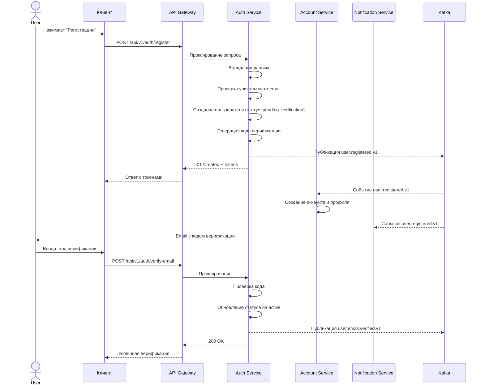

### 1.2. Покупка Игры

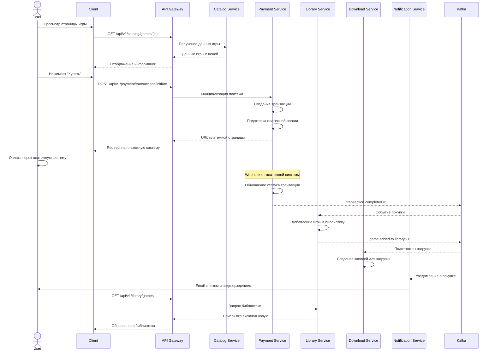

### 1.3. Загрузка и Установка Игры

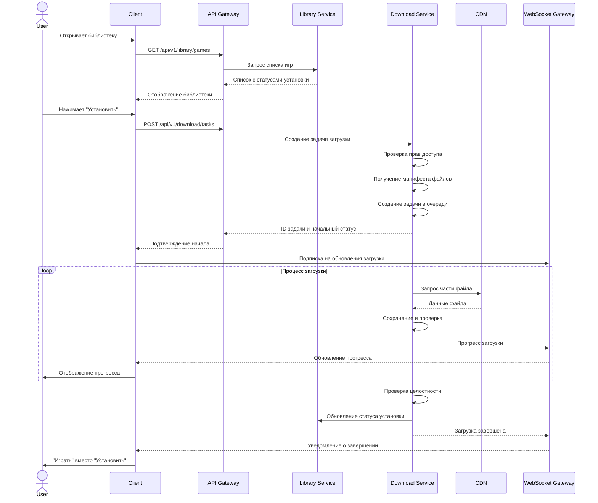

### 1.4. Социальное Взаимодействие

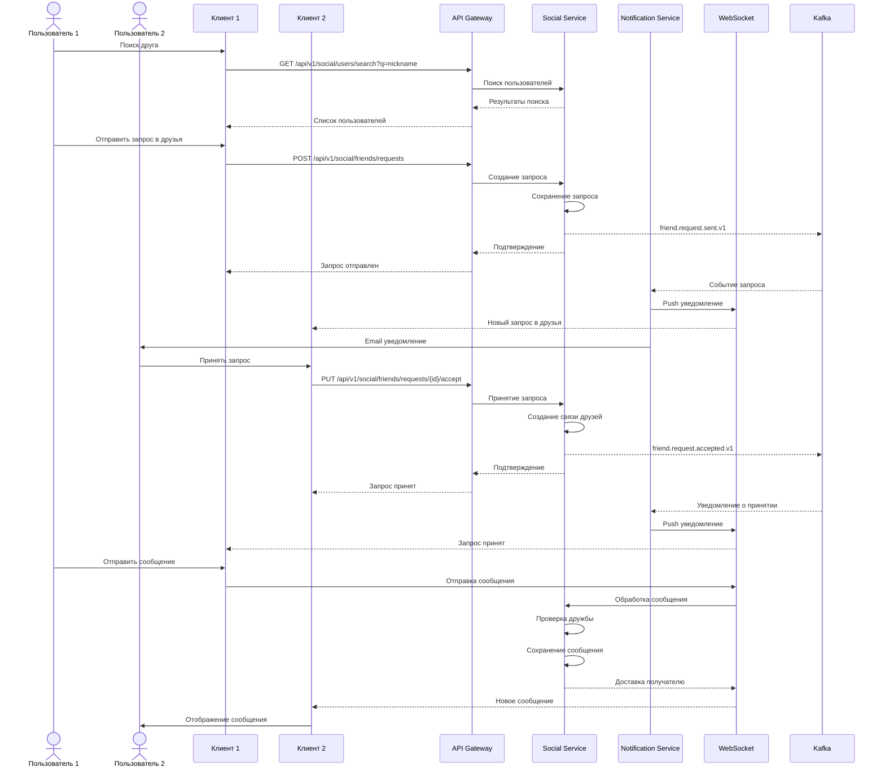

## 2. Сценарии Разработчика

### 2.1. Регистрация как Разработчик

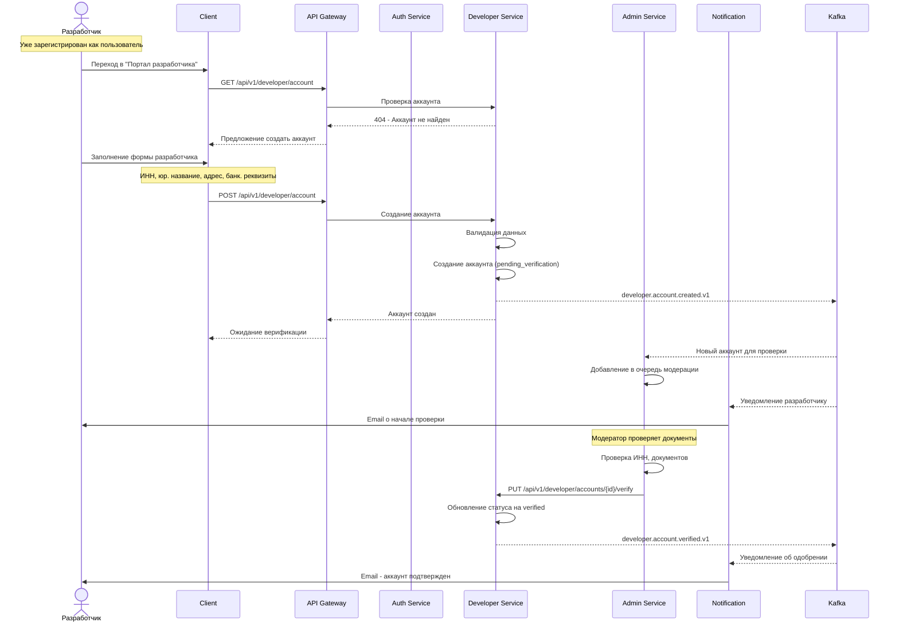

### 2.2. Публикация Новой Игры

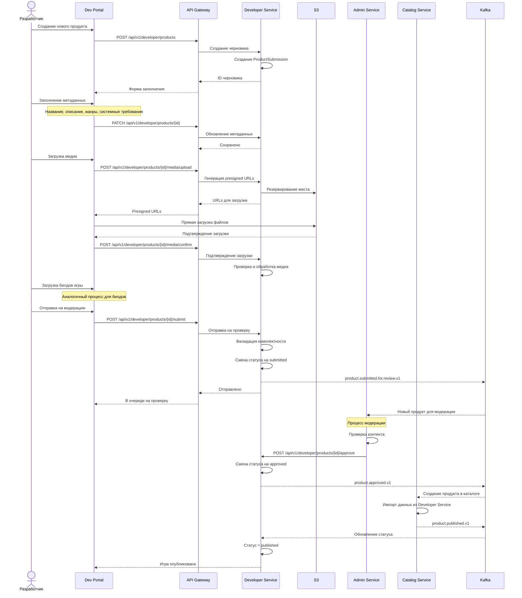

### 2.3. Получение Выплат

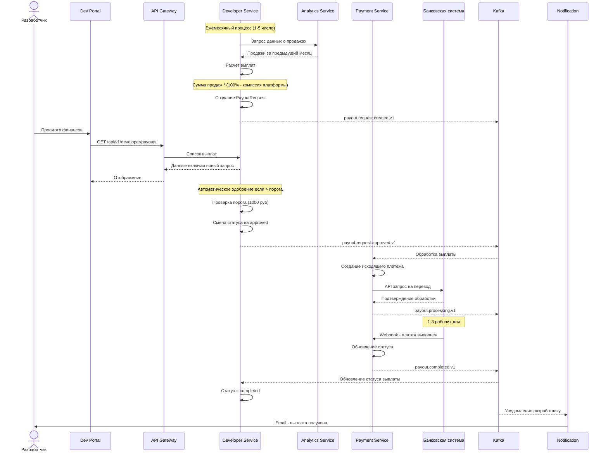

## 3. Сценарии Администратора

### 3.1. Модерация Контента

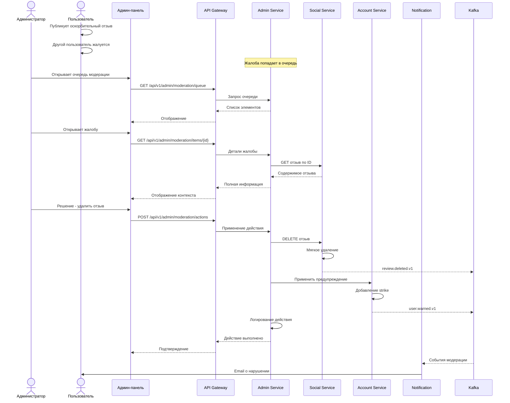

### 3.2. Управление Платформой

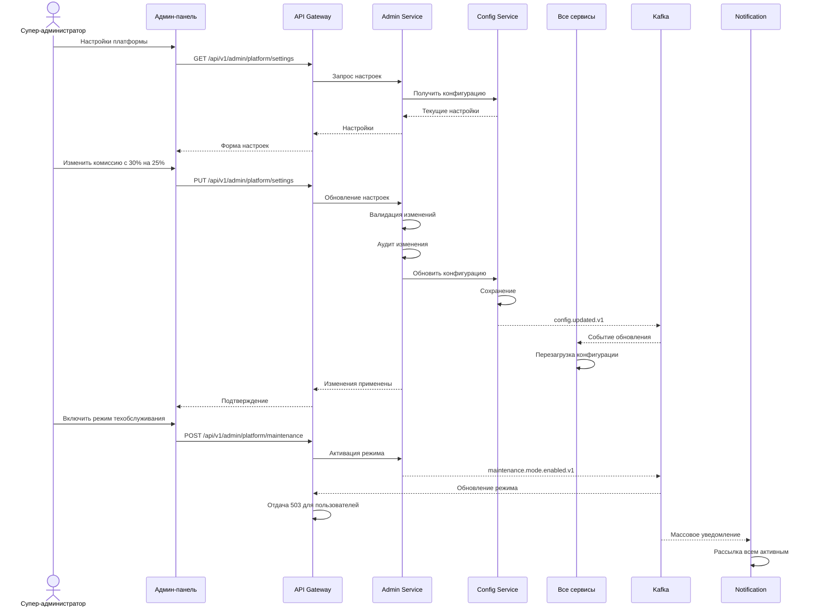

## 4. Интеграционные Сценарии

### 4.1. Обработка Платежа с Фискализацией

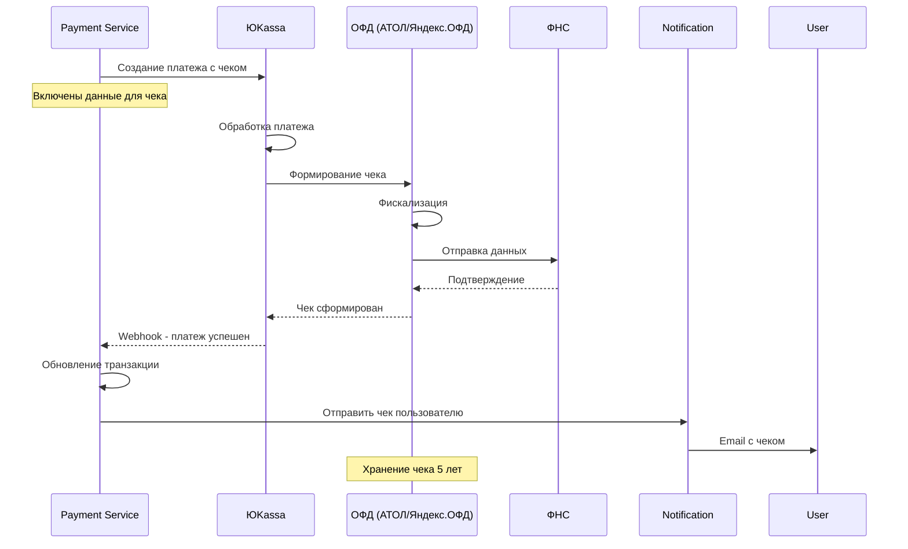

### 4.2. Синхронизация Игровых Сохранений

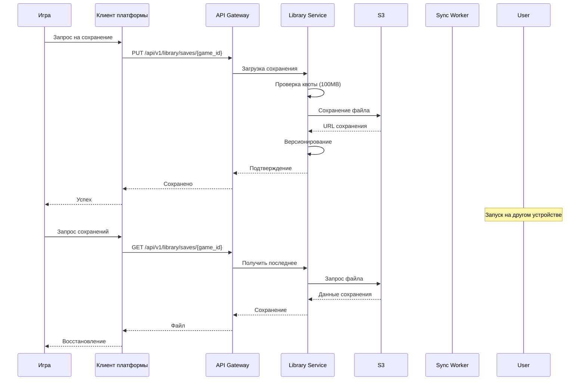

## 5. Аварийные Сценарии

### 5.1. Недоступность Payment Service

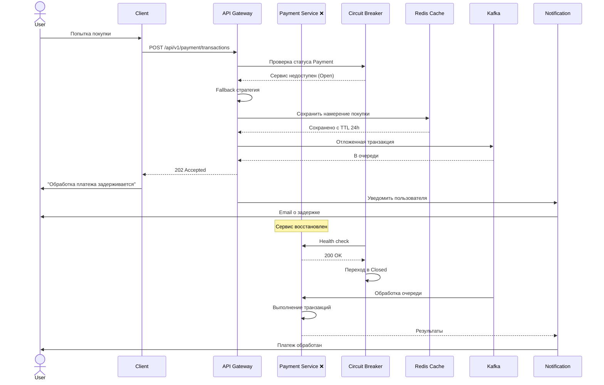

### 5.2. DDoS Атака

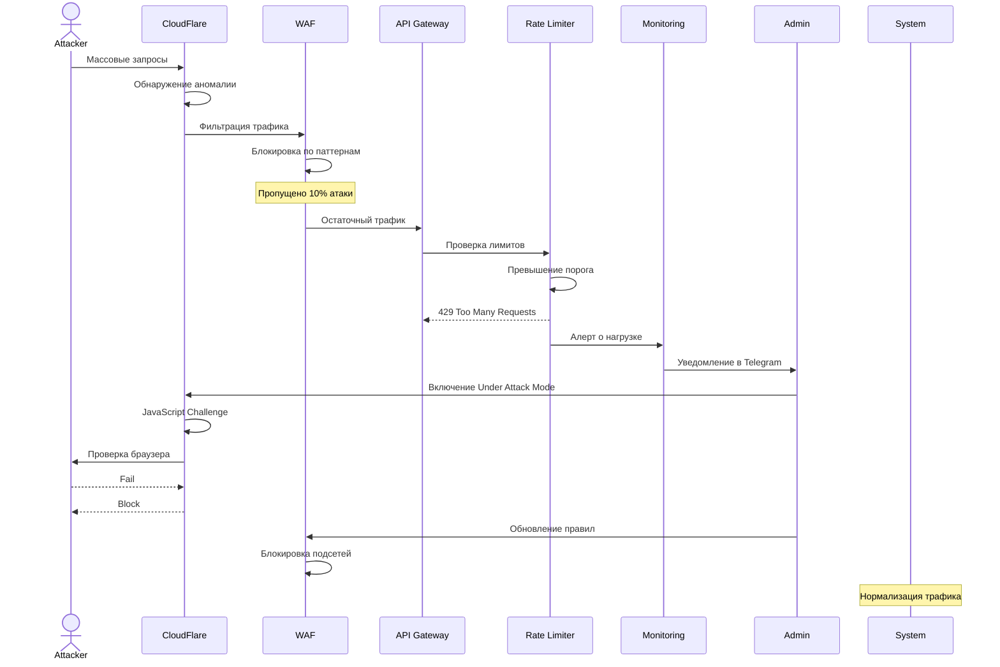

---
*Этот документ содержит основные пользовательские сценарии платформы. Дополнительные сценарии добавляются по мере развития функциональности.*